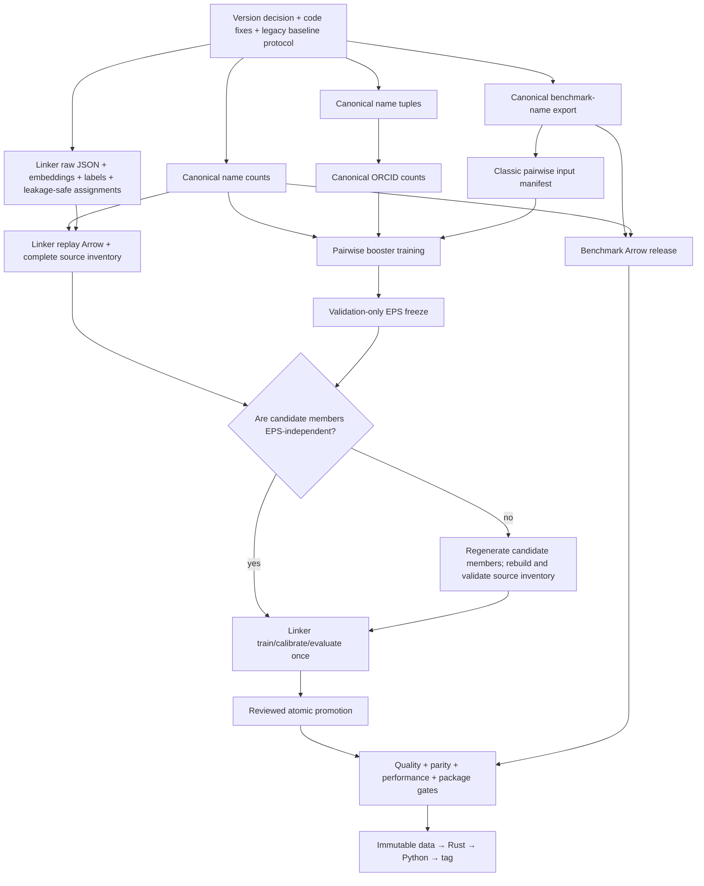

# S2AND v1.3 Release TODO

Status: blocked on the prerequisites in [Current blockers](#current-blockers).

Status date: 2026-07-24.

This is the operator runbook for regenerating the canonical-v2 artifacts,
training the pairwise and incremental-linker models, selecting the clustering
threshold, and releasing the result as model bundle v1.3.

The normalization contract and acceptance thresholds remain defined in
[normalization_migration_blocked.md](normalization_migration_blocked.md).
This document is the authority for execution order. The older
[work_plan.md](work_plan.md) is a remediation ledger, not a runnable sequence.

Do not start a warehouse query or full training run merely because an earlier
checkbox is complete. Each expensive stage requires:

1. a passing bounded preflight;
2. a reviewed exact command and immutable inputs;
3. explicit owner approval;
4. a detached launch with durable logs and a PID or scheduler job ID; and
5. a completion record with status, exit code, metrics, runtime, and peak RSS.

## Definition of done

The release is complete only when all of the following are true:

- [ ] The version matrix is explicit and internally consistent.
- [ ] The release uses one clean, exact training commit.
- [ ] Canonical tuples, name counts, ORCID counts, benchmark names, Arrow
      generations, pairwise boosters, clustering threshold, and incremental
      linker are bound by checked manifests and SHA-256 digests.
- [ ] Pairwise, clustering, end-to-end linking, subblocking, Python/Rust
      parity, runtime, and peak-RSS gates pass against a valid frozen baseline.
- [ ] The complete model is named `production_model_v1.3`.
- [ ] The public data release is immutable and versioned.
- [ ] Clean-installed Python and Rust distributions load and exercise the real
      v1.3 bundle, not a synthetic test bundle.
- [ ] Rust is published and independently installable before Python is
      published.
- [ ] The immutable quality report, pre-publish release attestation, and public
      release receipt together identify every command, input, output, digest,
      metric, approval, and exception without mutating an attested record.
- [ ] Rollback to the previous complete code-and-artifact release has been
      tested or demonstrated.

## Non-negotiable operating rules

- Use `uv` for every Python environment, command, test, and build.
- Never mix canonical-v2 code with legacy artifacts in a production, training,
  or release unit. The sole exception is the isolated Stage 1 comparison
  runner: it loads v1.21 in its frozen historical runtime and exports only
  identities, predictions, metrics, and provenance for comparison.
- Never replace an existing generation in place. Every full stage writes to a
  fresh path.
- Never tune or choose model parameters, EPS, linker parameters, metrics, or
  acceptance gates using test data. A test result may be revealed only after
  every decision it could influence is frozen, and then it may only pass or
  abort that declared protocol. In this flow, pairwise and cluster tests are
  deferred to Stage 8; the linker test reveal occurs in Stage 7 only after
  pairwise, EPS, linker parameters, metrics, and gates are frozen. Copying final
  test metrics into an immutable target after a pass is reporting, not a new
  selection step.
- Never infer data identity from a directory name. Compare manifests and
  digests.
- Do not run heavy work from Google Drive or another sync-managed directory.
  Use a local unsynced run root and a local clean clone/worktree.
- Do not use `--overwrite`, `--skip-validation`, or
  `--skip-name-counts-index` in a release run.
- Do not treat process disappearance as success. Validate the exit status and
  artifacts.
- Preserve failed outputs and logs. Do not silently restart a failed expensive
  job into the same directory.
- If code affecting a completed stage changes, apply the invalidation rules
  below before continuing.

## Release dependency graph



Name-count generation does not consume the tuple artifact. Tuple generation
and name-count generation may run independently after the code candidate is
frozen; only ORCID generation waits for the tuple artifact. Run warehouse jobs
sequentially if they contend for the same warehouse or machine.

Use this as the handoff ledger; the detailed gate in each stage remains
authoritative.

| Stage | Required handoff output | Expensive/external approval |
|---|---|---|
| 0 | Clean code candidate, passing focused/full tests, resolved implementation blockers | Repository owner |
| 1 | Reproducible legacy baseline with held-out-status evidence | Model owner |
| 2 | Reviewed tuple data + metadata digests | Artifact owner |
| 3 | Validated count/ORCID manifests and exact training commit | Warehouse/data owner before full queries |
| 4 | Classic pairwise manifest, Arrow release, leakage-safe linker source inventory | Data/model owner before full conversion |
| 5 | Reloadable pairwise stage, complete validation/trial report, sealed test identities | Model owner before full training |
| 6 | Frozen EPS, calibration curve, sealed cluster-test identities, final linker source inventory | Model owner before linker work |
| 7 | Reviewed complete `production_model_v1.3` with conditional promotion evidence | Model owner before mint/promotion |
| 8 | Immutable machine-readable passing quality report | Repository owner |
| 9 | Verified remote data/model and exact workflow-built distributions | Data/release owners before publish |
| 10 | Public smoke evidence and rehearsed rollback record | Repository owner |

## Current blockers

No full warehouse query, data conversion, model job, or publish workflow may
start until the blockers applicable to it are closed.

B02 is already closed at the current HEAD and remains in this ledger so blocker
IDs stay stable. Every other row is open until its required evidence is
recorded.

| ID | Blocker | Required resolution | Smallest verification |
|---|---|---|---|
| B01 | The release version meaning is ambiguous. | Decide whether Python/Rust remain `0.60.0` with model/data v1.3, or whether the packages become `1.3.0`. Record the decision in the release manifest. | `uv run --no-project python scripts/sync_version.py --check` and reviewed version matrix. |
| B02 | **Closed in `4a524d5`:** `scripts/production/counts/_run_support.py` is tracked. | Keep the shared helper tracked in every release candidate. | `git ls-files --error-unmatch scripts/production/counts/_run_support.py` returns the path, and clean-clone subprocess tests import both count producers. |
| B03 | **Closed:** both count producers use one module-only interface with relative package imports. | Keep `python -m scripts.production.counts...` as the documented interface; do not add a second bootstrap path. | Subprocess help and real fixture publications for both modules return zero from the repository root. |
| B04 | Rust edits do not invalidate uv's local wheel cache. | Add reviewed cache keys for every actual wheel input, including root/local `pyproject.toml`, `s2and_rust/README.md`, `s2and_rust/**/*.py`, `s2and_rust/Cargo.toml`, `s2and_rust/Cargo.lock`, `s2and_rust/build.rs`, `s2and_rust/src/**/*.rs`, and patched `s2and_rust/vendor/cld2/**/*` inputs. Do not omit Python/package inputs: custom uv cache keys replace the defaults. | In a disposable checkout, make a compiled behavior/constant change, observe a cache miss/rebuild in logs, and prove the installed native behavior or binary digest changes. A `cfg(test)`-only edit is not sufficient. |
| B05 | There is no valid v1.21 comparison protocol in current canonical code. | Run the historical model under a frozen compatible runtime/branch, or add an explicit comparison-only compatibility runner. Persist exact evaluation entity/block IDs, dataset hashes, assignments, and predictions. A guessed seed or recorded linker metrics is not sufficient. | A machine-readable legacy baseline can be rerun on the exact frozen evaluation population. |
| B06 | Benchmark canonical-name re-export has no deterministic producer, and side-by-side canonical columns would currently be ignored. `ANDData` and Arrow conversion consume the existing `author_info.first/middle/last` fields. | Define a reviewed output schema and add a deterministic signature-ID join. Either write joined canonical names into the exact consumed fields while preserving raw names in a separate immutable audit artifact, or update every loader/converter/trainer to explicitly select canonical fields. Report duplicate, missing, joined, unjoined, and divergence counts plus input/output digests. | A fixed end-to-end fixture proves duplicate/missing handling, deterministic output, preserved raw evidence, and that the exact names seen by `ANDData`, Arrow rows, and pairwise featurization are the joined canonical values. |
| B07 | Leakage-safe `combined_query_split_assignments.csv` has no producer. | Add a deterministic producer assigning splits at `base_group_id` granularity. | Validator reports zero base identities in more than one split and deterministic output for a fixed seed/input. |
| B08 | Real linker support paths are read from the wrong metadata mapping. | Resolve source paths from `assets.featureless_rows.files`, or explicitly normalize them into the model spec. Add a regression fixture shaped like the real bundle. | Source-bundle validation gets past support-file loading with the regenerated assignments. |
| B09 | The checked-in linker replay Arrow manifests predate the canonical generation contract. | Regenerate linker replay Arrow from the required raw JSON and SPECTER2 inputs and the exact new name-count index. | Deep local release validation passes; no manifest lacks normalization or generation identity. |
| B10 | There is no standalone pre-pairwise validator for the complete linker source bundle. | Add a source-bundle validation command that checks assets, support paths, assignments, required tables, Arrow generations, and name-count bindings without requiring a pairwise model. | The exact release source bundle passes before pairwise training is approved. |
| B11 | Pairwise preflight does not validate every fixed-pair CSV overlap before expensive featurization. | Move fixed-pair schema, duplication, and cross-split-overlap checks into preflight. | A deliberately overlapping fixture fails during preflight; current reviewed inputs pass. |
| B12 | Tooling is implemented in `release_pairwise.py`; real validation evidence is not yet recorded. | Run `calibrate-eps`, review every trial/identity digest, and reserve `evaluate-clusters` for Stage 8. Use `finalize-eps` only when review changes EPS. | Focused tests prove fresh-output finalization changes only `clusterer.json`/`manifest.json`, preserves all other bytes, and reloads; the real calibration report remains a release gate. |
| B13 | **Implementation closed; promotion still depends on B20.** Candidate runs retain the exact evaluated artifact bound to `candidate_target.json` and a deterministic query-level CSV plus its row/column/byte/SHA-256 inventory. | Preserve this evidence and add only B20's reviewed lifecycle transition; do not retrain to recover the candidate artifact. | Focused tests prove the artifact is retained and prediction export is order-independent with explicit identity/label columns. |
| B14 | The linker README target path is inside an output directory that must not exist. | Keep seed and reviewed candidate-target JSON files in an immutable input directory separate from every output directory. | The documented preflight command can run exactly as written. |
| B15 | Package/default-model policy is unresolved. | Choose either an explicit external v1.3 model bundle or a packaged default. A packaged default requires package-data entries, `default_production_model.json`, loader behavior, and tests. | Built wheel/sdist inventory and public loader behavior match the reviewed decision. |
| B16 | Installed-package smoke uses a synthetic model. | Add a clean-environment smoke that locates, loads, and predicts with the real candidate v1.3 bundle and embedded fixtures. | Smoke passes using only installed distributions plus the declared release artifact. |
| B17 | Data publication and stable-pointer promotion are not defined. | Define the immutable candidate prefix, upload command, verification command, stable pointer/update procedure, permissions, and rollback. | Candidate is re-downloaded and every size/digest/inventory entry matches before pointer promotion. |
| B18 | A newly generated root manifest has no command for registering a nested linker replay bundle. | Add a release-assembly command that registers the replay bundle manifest, preserves its checksum/inventory, refreshes validation commands, and installs required root helper files such as `LICENSE.txt`. `refresh-root-manifest` only refreshes entries that are already declared. | `validate_local_arrow_release.py` validates benchmark datasets, the nested replay datasets, root name counts, helpers, and all manifest checksums from one fresh release root. |
| B19 | Non-Arrow linker assets have no complete immutable inventory. | Make source-bundle assembly inventory `bundle.json`, labels, candidate members, assignments/summaries, the nested Arrow root manifest, and every other consumed file with byte sizes and SHA-256 digests. Verify that inventory during linker preflight. | Equal-size/equal-mtime mutation of any source-bundle input fails preflight, and `release.json.inputs.linker_source_bundle_sha256` identifies the complete inventory. |
| B20 | Linker target loading does not enforce target schema/status/variant, and the current artifact digest contract makes a naïve candidate-to-production status edit impossible. | Validate all lifecycle fields at load and emit diagnostic targets with candidate status. Add one atomic, no-retraining reviewed transition that verifies the candidate target/artifact/approval, emits a production target, updates final artifact metadata so `target_spec_digest` matches that production target, and preserves the candidate target digest as parent provenance. Apply it to preferred and fallback paths. | Lifecycle tests prove candidate status cannot ship, an edited target cannot bypass digest checks, and final production target/artifact digests agree while retaining verifiable candidate ancestry. |
| B21 | Pairwise subset smoke returns before bundle publication and Rust fixture reload. | Add a tiny explicit publication-boundary smoke that writes a pairwise-only bundle from a fitted fixture, reloads it, and compares Rust booster predictions before the full job. Do not claim `--datasets` covers publication. | The exact full-run environment passes the writer/reloader smoke with the freshly built native extension. |
| B22 | `--train-pairs-size` and `--val-test-size` do not bound fixed-pair datasets such as `augmented`. | Create a deterministic, manifest-backed, pre-sampled pairwise smoke root containing one clustered dataset plus bounded augmented train/validation/test CSVs and their required JSON/embeddings. | Smoke input inventory proves the actual fixed-pair row counts and remains small enough for a bounded run. |
| B23 | Pairwise training summary omits validation metrics, hyperparameter trial evidence, and a sealed test-identity record. | Persist main/nameless validation metrics, trial tables, selected parameters/objectives, train/validation identities, and a content-addressed test manifest without scores. Stage 8 test results are a separate immutable output. | The full-run report has complete finite selection evidence and proves test identities were sealed but not evaluated. |
| B24 | Distribution verification does not currently enforce canonical tuple data and metadata. | Extend distribution inventory verification to require the exact reviewed tuple data and adjacent metadata, in addition to ORCID artifacts and any chosen model/default files. | Removing or altering either tuple file makes wheel/sdist verification fail. |
| B25 | The relationship between selected EPS and linker candidate-member components is not proven or bound. | Prove from producer provenance that candidate members are independent of EPS, or regenerate them after EPS freeze. Bind that decision and all component inputs in the source-bundle inventory. | Changing EPS either leaves a reviewed independence proof valid or deterministically invalidates/regenerates the affected linker source bundle. |
| B26 | Publish jobs do not consume the immutable quality/attestation records, remote-data verification, or real-v1.3 smoke, and a separate publish run would rebuild rather than publish the reviewed bytes. | Add an explicit release-gate and exact artifact continuity: preferably one build → gate → protected approval → publish run, or a promotion mode that downloads and verifies artifacts from an approved run ID/digest manifest. Both publish jobs must consume the gate. The real smoke must use packaged bytes or an immutable URL+digest, and public-index hashes must equal the attested candidates. | A bad quality report, attestation, remote inventory, real smoke, or artifact digest makes publication unreachable; PyPI hashes equal the approved workflow artifacts. |
| B27 | The count CLIs accept `--source-snapshot-id` as an unchecked label; neither warehouse query is actually bound to that identity. | Use an owner-approved immutable warehouse snapshot, transaction/export, or immutable source object and make the executed query provenance prove that exact identity. Record the query text, query ID, source object/snapshot, timestamps, and result digest. | Changing the typed label alone cannot satisfy preflight; an independent reviewer can trace both full query results to the recorded immutable warehouse source. |
| B28 | The internal `pys2` warehouse client is neither pinned in `pyproject.toml`/`uv.lock` nor consistently imported by both count producers. | Choose one supported import/API and a reviewed, uv-managed internal source/version/commit. Add an exact provisioning/overlay command and record distribution metadata, source digest, and dependency lock without adding an accidental public production dependency. | On the internal host, both producers import the same pinned client in the recorded uv environment and a tiny query succeeds; an unpinned ambient install fails preflight. |
| B29 | Destination name-count validation does not report the selected generation/manifest digest or exercise the configured `NAME_COUNTS_INDEX_PATH`. | Extend the validator or add an exact inspection command that reports resolved generation files and manifest SHA-256, then add a production-loader smoke through `S2AND_PATH_CONFIG`/`s2and.consts.NAME_COUNTS_INDEX_PATH`. | The copied `$DataRoot` index is resolved through the same selector used by training, and the reported digest equals `release.json`. |
| B30 | **Implementation closed; real one-shot evidence remains Stage 8.** Full release training records only `--pairwise-test-manifest-sha256`, resolves/featurizes train and validation only, and emits no real test metrics. `release_pairwise.py evaluate-pairs` is the sole sealed evaluator. | Keep smoke-only test metrics isolated under `smoke_pairwise_test_metrics`; never pass a test-manifest path to full training. | Focused tests prove full input resolution omits fixed test pairs, release staging has no test arrays, the evaluator rejects digest drift, averages main/nameless probabilities once, and uses strict `> 0.5`. |

A blocker that requires a new producer, validator, evaluator, finalizer, smoke,
or workflow gate is not closed until this runbook contains its exact supported
command/inputs/outputs and the focused verification passes. Conceptual prose or
an unrecorded one-off command is not closure.

### Risks that require explicit preflight evidence

These are not all confirmed production defects, but they are reachable enough
to guard before a full run:

- The two count producers currently import the internal `pys2` query helper
  differently. Close B28 with one pinned uv-managed source and one supported
  import/API; an ambient internal-host installation is not release evidence.
- Verify how SQL `NULL`, SQL empty string, pandas `NA`, and NumPy `NaN` arrive
  from `pys2`. Reject missing sentinels before calling `str(...)`; otherwise a
  literal `"nan"` can become a high-count canonical key.
- The warehouse queries materialize complete DataFrames before Python
  guardrails execute. `LIMIT` bounds returned rows, not warehouse scan/sort
  cost.
- The ORCID distinct-name fanout guard executes after query cost and DataFrame
  allocation. Add an approved warehouse-side fanout probe that matches the
  Python grouping semantics closely enough to be conservative.
- Name-count generation holds the result DataFrame and four Python counters
  concurrently. Measure peak RSS on a representative sample and extrapolate;
  do not treat an unmeasured 25 GB estimate as a fact.
- Run the name-count fixture in the exact full-run environment because its
  writer import occurs after source processing.
- Keep all long-run output, matrix, and feature-cache directories off Google
  Drive. Sync-client file locks can break final `os.replace` publication.

## Version matrix

Complete this table before artifact generation. Do not infer one version from
another.

| Component | Planned version | Decision owner | Status |
|---|---:|---|---|
| Production model bundle | `1.3` | TBD | fixed target |
| Public data release | `1.3` or reviewed immutable generation | TBD | TBD |
| Python package | `0.60.0` or `1.3.0` | TBD | **decision required** |
| Rust package | must equal Python package under current exact pin | TBD | **decision required** |
| Normalization contract | `canonical_v2` | repository contract | fixed |
| Featurizer contract | `10` | repository contract | fixed |

Before retaining any package version, prove that exact `s2and` and
`s2and-rust` version is not already published on the target index and save the
lookup evidence. Published package versions are immutable; `0.60.0` cannot be
reused if it already exists.

If package version `1.3.0` is selected:

1. edit `VERSION`;
2. run `uv run --no-project python scripts/sync_version.py`;
3. run `uv lock --check`;
4. run `uv sync --all-extras --locked`;
5. run
   `uv run --active --no-project cargo metadata --locked --manifest-path s2and_rust/Cargo.toml --format-version 1`;
6. review all changed manifests and locks; and
7. rerun all code and distribution gates.

Do not run `cargo generate-lockfile` merely because the package version
changed: it can resolve newer compatible dependencies at release time.
Regenerate either lock only as an explicit, separately reviewed dependency
update.

Version changes must land before the exact training commit is frozen if the
version is embedded in any trained artifact or release manifest.

## Release record and local layout

Use a local unsynced root. The examples use PowerShell variables, but the same
logical layout applies on another host.

```powershell
$Repo = (Resolve-Path ".").Path
$ReleaseId = "s2and-model-v1.3-YYYYMMDD"
$RunRoot = "D:\s2and-release-v1.3\$ReleaseId"
$DataRoot = "$RunRoot\data-root"
$Logs = "$RunRoot\logs"
$Stages = "$RunRoot\stages"
$Inputs = "$RunRoot\inputs"
$Reports = "$RunRoot\reports"
$PairwiseDataRoot = "$Inputs\pairwise-data"
$PairwiseSmokeDataRoot = "$Inputs\pairwise-smoke-data"
```

Create the parent/work directories before preflights. `DataRoot` starts empty;
Stage 3.6 populates and validates its complete `name_counts_index`. No training
may begin until that destination copy passes validation. Do not seed it with a
legacy index.

```text
<run-root>/
  release.json
  approvals/
  inputs/
    fixtures/
      name_count_rows.json
      orcid_rows.json
      expected_metrics.json
    path_config.json
    pairwise-data/
    pairwise-smoke-data/
    guardrails/
    targets/
    warehouse/
  logs/
  matrix-work/
  matrix-work-smoke/
  feature-cache/
  feature-cache-smoke/
  smoke/
  reports/
    baseline/
    counts/
    data/
    pairwise/
    eps/
    linker/
    quality_report.json
    release_attestation.json
    public_release_receipt.json
  stages/
    tuples/
    orcid/
    pairwise/
    pairwise-smoke/
    pairwise-calibrated/
    linker/
    complete-model/
  data-root/
    # populated only by reviewed promotion/conversion stages:
    name_counts_index/
    <benchmark-dataset>/
    s2and_and_big_blocks_linker_dataset_v1_3/
    LICENSE.txt
    manifest.json
```

Create `matrix-work` and `matrix-work-smoke` explicitly: the pairwise CLI
requires each directory to exist. Keep both empty before their first run and
record writability, free space, and resolved local paths. Create only parents
for outputs that the CLIs require to be absent.

```powershell
$MatrixRoots = @(
  "$RunRoot\matrix-work",
  "$RunRoot\matrix-work-smoke"
)
foreach ($MatrixRoot in $MatrixRoots) {
  if (-not (Test-Path -LiteralPath $MatrixRoot -PathType Container)) {
    New-Item -ItemType Directory -Path $MatrixRoot | Out-Null
  }
  if (@(Get-ChildItem -LiteralPath $MatrixRoot -Force).Count -ne 0) {
    throw "Matrix work directory must start empty: $MatrixRoot"
  }
}
```

Use a run-specific `inputs/path_config.json`:

```json
{
  "main_data_dir": "D:\\s2and-release-v1.3\\RELEASE_ID\\data-root",
  "internal_data_dir": "REVIEWED_INTERNAL_DATA_ROOT"
}
```

Set it before any Python process imports `s2and.consts`:

```powershell
$env:S2AND_PATH_CONFIG = "$Inputs\path_config.json"
```

The large name-count index is selected from
`<main_data_dir>/name_counts_index`. Canonical tuples and ORCID counts are
loaded from the checkout's `s2and/data`, so their reviewed bytes must be
promoted into the clean release-candidate checkout before the exact training
commit is frozen.

### Minimum `release.json`

Keep this file beside the run, not only in chat. Extend it as needed; do not
remove identities.

```json
{
  "release_id": "s2and-model-v1.3-YYYYMMDD",
  "status": "planning",
  "versions": {
    "model_bundle": "1.3",
    "data_release": "TBD",
    "python_package": "TBD",
    "rust_package": "TBD",
    "normalization": "canonical_v2",
    "featurizer": 10
  },
  "git": {
    "training_commit": "TBD",
    "git_dirty": false
  },
  "environment": {
    "uv_lock_sha256": "TBD",
    "python_version": "TBD",
    "rust_toolchain": "TBD",
    "native_extension_sha256": "TBD",
    "warehouse_client_source": "TBD",
    "warehouse_client_version": "TBD",
    "warehouse_client_sha256": "TBD",
    "thread_environment": {
      "OMP_NUM_THREADS": "TBD",
      "RAYON_NUM_THREADS": "TBD",
      "MKL_NUM_THREADS": "1",
      "OPENBLAS_NUM_THREADS": "1",
      "NUMEXPR_NUM_THREADS": "1",
      "PYTHONUNBUFFERED": "1"
    }
  },
  "inputs": {
    "version_availability_evidence_sha256": "TBD",
    "legacy_baseline_manifest_sha256": "TBD",
    "name_tuple_data_sha256": "TBD",
    "name_tuple_metadata_sha256": "TBD",
    "name_counts_manifest_sha256": "TBD",
    "name_counts_warehouse_provenance_sha256": "TBD",
    "orcid_data_sha256": "TBD",
    "orcid_manifest_sha256": "TBD",
    "orcid_warehouse_provenance_sha256": "TBD",
    "benchmark_release_manifest_sha256": "TBD",
    "pairwise_classic_inputs_manifest_sha256": "TBD",
    "pairwise_smoke_inputs_manifest_sha256": "TBD",
    "pairwise_test_manifest_sha256": "TBD",
    "cluster_test_manifest_sha256": "TBD",
    "linker_source_bundle_sha256": "TBD",
    "linker_assignments_sha256": "TBD",
    "linker_candidate_members_sha256": "TBD",
    "linker_test_manifest_sha256": "TBD"
  },
  "protocols": {
    "acceptance_policy_sha256": "TBD",
    "pairwise": {
      "datasets": [
        "aminer",
        "arnetminer",
        "inspire",
        "kisti",
        "orcid",
        "pubmed",
        "qian",
        "zbmath",
        "augmented"
      ],
      "n_iter": 50,
      "cluster_n_iter": 25,
      "data_random_seed": 1111,
      "selection_protocol_sha256": "TBD",
      "n_jobs": "TBD",
      "total_ram_bytes": "TBD"
    },
    "clusterer": {
      "selection_split": "validation_only",
      "objective": "signature_weighted_b3_f1",
      "search_space": "TBD",
      "tie_break_policy": "TBD",
      "selection_protocol_sha256": "TBD"
    },
    "linker": {
      "n_jobs": "TBD",
      "total_ram_bytes": "TBD",
      "selection_protocol_sha256": "TBD",
      "seed_target_sha256": "TBD",
      "reviewed_candidate_target_sha256": "TBD",
      "production_target_sha256": "TBD"
    }
  },
  "acceptance": {
    "pairwise_aggregate_auc_max_drop": 0.001,
    "pairwise_aggregate_f1_max_drop": 0.005,
    "pairwise_per_dataset_policy": "TBD",
    "cluster_signature_weighted_b3_f1_max_drop": 0.005,
    "cluster_per_dataset_b3_f1_policy": "TBD",
    "linker": {
      "primary_metric": "TBD",
      "primary_metric_max_drop": "TBD",
      "minimum_positive_recall": "TBD",
      "minimum_negative_recall": "TBD",
      "maximum_wrong_link_rate": "TBD",
      "maximum_false_link_rate": "TBD",
      "abstention_policy": "TBD",
      "per_source_and_bucket_policy": "TBD"
    },
    "subblocking": {
      "size_distribution_tolerance": "TBD",
      "merge_behavior_policy": "TBD",
      "sensitive_population_policy": "TBD",
      "giant_block_policy": "TBD"
    },
    "runtime_max_regression_fraction": 0.1,
    "peak_rss_max_regression_fraction": 0.1
  },
  "outputs": {
    "pairwise_bundle_manifest_sha256": "TBD",
    "calibrated_pairwise_bundle_manifest_sha256": "TBD",
    "linker_candidate_artifact_sha256": "TBD",
    "linker_candidate_model_payload_sha256": "TBD",
    "production_linker_artifact_sha256": "TBD",
    "production_linker_model_payload_sha256": "TBD",
    "complete_model_manifest_sha256": "TBD",
    "remote_data_candidate_inventory_sha256": "TBD",
    "workflow_artifact_inventory_sha256": "TBD",
    "quality_report_sha256": "TBD",
    "release_attestation_sha256": "TBD",
    "public_release_receipt_sha256": "TBD"
  },
  "approvals": {
    "pre_unblind_policy": null,
    "legacy_baseline": null,
    "canonical_tuples": null,
    "warehouse_counts": null,
    "canonical_data_conversion": null,
    "pairwise_full": null,
    "eps_freeze": null,
    "linker_mint_and_test_reveal": null,
    "linker_promotion": null,
    "stage8_pairwise_cluster_test_reveal": null,
    "quality_report": null,
    "release_attestation": null,
    "remote_data_candidate": null,
    "release_publish": null
  }
}
```

`TBD` is not an accepted launch value.

Likewise, every `REVIEWED_*` or `EXACT_*` token in a command below is an
operator-visible placeholder. Replace it with the approved literal value,
record the expanded command in `launch.json`, and review that exact command
before execution.

### Per-job launch record

Before every full job, write a stage-specific `launch.json` containing:

- exact command and working directory;
- exact Git commit and dirty status;
- package lock and native library identity;
- host, OS, CPU, RAM, GPU if applicable, and the exact inherited environment
  map for `S2AND_BACKEND`, `OMP_NUM_THREADS`, `RAYON_NUM_THREADS`,
  `MKL_NUM_THREADS`, `OPENBLAS_NUM_THREADS`, `NUMEXPR_NUM_THREADS`,
  `PYTHONUNBUFFERED`, and any job-specific variables;
- source manifests and SHA-256 digests;
- reviewed configuration and seed;
- output, stdout, stderr, and telemetry paths;
- PID or scheduler job ID;
- start time, expected duration/cost, and monitoring cadence;
- success criteria;
- whether the command can read test identities, the frozen pre-unblind gate
  digest, and the one-shot authorization/previous-unblind state;
- owner approval and timestamp; and
- whether the job supports checkpoint/resume.

The current pairwise and linker jobs do not provide useful checkpoint/resume.
A crash normally means a fresh output directory and a complete rerun. Preserve
the failed run.

For a Windows host, an approved detached launcher may use
`Start-Process -WindowStyle Hidden -PassThru` with separate stdout and stderr
files. A scheduler is preferable when available. Never launch the full command
as a foreground call with a timeout that can kill it.

Monitor with short bounded checks of:

- process or scheduler state;
- log size and the last bounded set of lines;
- progress events and artifact timestamps;
- CPU and peak/current RSS;
- free disk space; and
- warnings, retries, or stalls.

On completion, write `completion.json` with exit code, finish time, elapsed
time, final status, output inventory, metrics, peak RSS, warnings, and
validation results.

## Invalidation rules

Use the conservative rule when a dependency is unclear.

| Change after a stage completes | Invalidate at least |
|---|---|
| Canonicalization, count-key, feature, Arrow, Rust featurizer, or serialization code | All generated data and all models downstream of that behavior |
| Canonical tuple bytes or metadata | ORCID counts, pairwise, EPS, linker, complete bundle, and release gates |
| Name-count generation, manifest, or index bytes | Arrow generations, pairwise, EPS, linker, complete bundle, and release gates |
| ORCID count bytes or manifest | Pairwise, EPS, linker, complete bundle, and release gates |
| Benchmark canonical-name export or benchmark source bytes | Benchmark Arrow, pairwise, EPS, linker, and release gates |
| Linker raw/embedding/label/member/source-bundle bytes or assignments | Linker Arrow/materialization, linker, and linker/end-to-end gates |
| Legacy baseline/comparison manifest, metric formula/aggregation, or acceptance-policy digest before any affected reveal | Baseline approval and every dependent calibration/evaluation gate; freeze and approve a new pre-unblind digest |
| Sealed pairwise, cluster, or linker test population/identity digest before reveal | Matching baseline results plus every calibration/evaluation artifact that assumes that population |
| Any metric/gate/test-population change after its result was revealed | Abort that protocol. Do not merely rerun the gate; establish a genuinely untouched holdout and new approved pre-unblind policy |
| Pairwise training config, split identities, boosters, or feature contract | EPS, linker, complete bundle, and all model gates |
| Selected `cluster_model.eps` only, with every other clusterer field byte-identical | Cluster gates and complete bundle; apply B25 and rerun linker source validation/preflight/finalization unless the reviewed provenance proves candidate-member independence |
| Any `clusterer.json` field other than only `cluster_model.eps` | Treat as a pairwise/clusterer artifact change: EPS selection, linker, complete bundle, and all model gates |
| Linker target, features, parameters, split, or gate policy | Linker candidate, complete bundle, and linker/end-to-end gates |
| `uv.lock`, resolved Python environment, compiler/toolchain, native-extension binary, or native build inputs | Every generated-data or model stage executed under the prior identity, plus parity/performance/package gates; do not assume equal source means equal features |
| Python/Rust package version or package contents | Distribution build, installed smoke, publication, and post-publish verification |
| Training/evaluation code after the training commit | Every stage whose inputs or interpretation can be affected; freeze a new commit |

## Stage 0: make the repository runnable

### 0.1 Close blockers and add focused tests

- [ ] Every repository-code, workflow, schema, validator, and test change
      required by B01-B30 is merged before the code-only candidate is frozen.
      Stage-specific runs, reviews, and external approvals may occur later;
      implementation may not.
- [ ] B01, B03, and B04 are closed, B02's tracked-file closure is reverified,
      and B05's comparison runner/protocol is implemented before its real
      baseline evidence is collected in Stage 1.
- [ ] B06-B11 implementations and focused fixtures are closed before approving
      expensive model work; their real-data products still pass Stage 4.
- [ ] B12-B20 and B27-B30 have an owner, implemented contracts, and focused
      tests; their real-data evidence must pass before each dependent stage.
- [ ] B21-B23 are closed before the full pairwise launch.
- [ ] B24 is closed before distribution assembly.
- [ ] B25 is closed before linker source freeze.
- [ ] B26 is closed before any publish-enabled workflow.
- [ ] Count command tests run subprocesses rather than only importing modules.
- [ ] The linker support-path test uses a real-bundle-shaped fixture.
- [ ] Split generation tests prove `base_group_id` disjointness.
- [ ] Missing-value boundary tests reject pandas/NumPy missing sentinels.
- [ ] Rust cache behavior and installed-native smoke are covered.

### 0.2 Establish a controlled environment

For general development/release work, install all extras:

```powershell
uv lock --check
uv sync --all-extras --locked
```

Use the canonical local-CI wrapper for the native build and complete suite. It
syncs without installing the cached Rust package, builds with Maturin, and runs
subsequent commands with `--no-sync`.

```powershell
uv run --no-project python scripts/run_ci_locally.py
```

Record the wrapper log. A plain green `uv run pytest` is insufficient evidence
if native cache identity is unknown.

Freeze a reviewed thread environment before any preflight, smoke, detached
worker, or imported model code. Do not rely on a script assigning
`OMP_NUM_THREADS` after LightGBM or another native library has already been
imported. For one process intended to use `REVIEWED_THREAD_COUNT` cores, the
default starting envelope is:

```powershell
$env:OMP_NUM_THREADS = "REVIEWED_THREAD_COUNT"
$env:RAYON_NUM_THREADS = "REVIEWED_THREAD_COUNT"
$env:MKL_NUM_THREADS = "1"
$env:OPENBLAS_NUM_THREADS = "1"
$env:NUMEXPR_NUM_THREADS = "1"
$env:PYTHONUNBUFFERED = "1"
```

If an outer scheduler launches multiple workers, divide cores deliberately and
normally set each worker's inner thread counts to `1`; do not stack full-size
outer and inner pools. Record the exact values in `release.json` and every
`launch.json`, ensure detached children inherit them, and keep them identical
between comparable baseline/candidate runs. See [threading.md](threading.md).

### 0.3 Freeze the code-only candidate

Before generating artifacts:

```powershell
git status --short
git rev-parse HEAD
uv lock --check
uv run --no-project python scripts/sync_version.py --check
git diff --check
```

Requirements:

- [ ] The intended release changes are committed.
- [ ] The worktree is clean.
- [ ] The commit is pushed and CI is green.
- [ ] `release.json` records the code-candidate commit.
- [ ] No unrelated dirty files are present.

Small artifacts generated below will later be promoted into a new clean
release-candidate commit. No Python or Rust behavior changes are allowed after
full model training begins.

If a later stage discovers that a promised command or validation contract was
not actually implemented, stop and freeze a new code candidate; do not patch
training/evaluation/release behavior around an already generated artifact.

## Stage 1: establish the legacy baseline

This stage occurs before choosing EPS or judging the new model.

The current canonical loader cannot load v1.21, and v1.21 does not contain
`reproducibility/pairwise_training_config.json`. Therefore:

- do not add a guessed seed to current production evaluation;
- do not compare against v1.21 linker metadata as a substitute for pairwise or
  clustering metrics; and
- do not compare on a newly randomized or leakage-changed population.

### Pre-baseline unblinding gate

Before executing or reading the historical evaluation, freeze and hash:

- the complete metric set, formulas, thresholds, denominators, aggregation and
  weighting rules;
- the primary metric and every numeric drop/floor/ceiling policy in
  `release.json.acceptance`;
- per-dataset, source, bucket, abstention, subblocking, and exception policies;
- every new-model feature set, dataset/split rule, hyperparameter search space,
  seed, EPS objective/grid/tie-break, and linker train/calibration/target
  protocol that could otherwise respond to the baseline result;
- exact pairwise pairs, cluster identities, and linker query/base-group
  comparison manifests; and
- any rule for deriving a threshold without inspecting a test outcome.

No acceptance field may remain `TBD` merely because the new artifacts do not
exist yet; unrelated future artifact digest fields may remain `TBD`. The owner
approves this pre-unblind policy digest before the baseline report is produced.
After reveal, deterministic artifact identities may be filled in, but no
quality-affecting protocol above may change without aborting and establishing a
new untouched comparison protocol.

### Required implementation/protocol

- [ ] Select the exact historical S2AND/Rust environment that legitimately
      loads v1.21, or implement an explicitly comparison-only compatibility
      runner.
- [ ] Freeze source dataset bytes and hashes.
- [ ] Recover the historical training/validation/test identity lists where
      available and prove the comparison population was held out from v1.21
      training.
- [ ] Freeze exact pairwise pairs, cluster blocks, signature IDs, and linker
      query/base-group assignments used for comparison.
- [ ] Export the selected identities and predictions, not only aggregate
      metrics.
- [ ] Record hardware, dependency versions, thread counts, warmups, and
      repetitions for performance metrics.
- [ ] Produce a machine-readable baseline report.
- [ ] Export the **effective runtime EPS**, not merely serialized best
      parameters. For v1.21 the runtime reference is `0.65`; the stored
      `0.6064583975886222` value is stale and must not be used as the comparator.

The baseline report must include at least:

- per-dataset pairwise AUROC and macro F1 using averaged main/nameless
  positive probabilities and a strict `> 0.5` F1 threshold, plus the exact
  aggregate weighting;
- per-dataset, macro, and signature-weighted aggregate B3
  precision/recall/F1;
- end-to-end linker metrics on a clearly identified population;
- subblocking distributions and key cases;
- Python/Rust parity evidence applicable to the historical release;
- runtime and peak RSS under the pinned performance protocol; and
- the exact evaluation entity/block/query IDs and input hashes; and
- effective runtime configuration, including the resolved `0.65` v1.21 EPS
  provenance.

If v1.21 training identities cannot be recovered, label the affected result
`training_overlap_unknown`; it cannot be the headline non-regression claim.
Use a separately frozen independent gold population for the release headline
and retain the overlap-unknown comparison only as secondary evidence.

### Gate

- [ ] Another operator can rerun the baseline from the recorded environment
      and obtain the declared metrics.
- [ ] The owner approves the baseline population and metric definitions.
- [ ] The report's metric/gate policy digest equals the approved pre-unblind
      digest.
- [ ] Held-out status is proven, or the report clearly separates
      overlap-unknown secondary metrics from independent-gold headline metrics.
- [ ] `release.json.inputs.legacy_baseline_manifest_sha256` is filled.
- [ ] Authoritative pairwise, cluster, and linker comparison/test manifests are
      content-addressed in `release.json`; later stages may validate but not
      silently replace their populations.

## Stage 2: regenerate canonical name tuples

Tuple generation is cheap and local. It must happen before ORCID counts because
the ORCID manifest records the exact tuple-data SHA-256.

### 2.1 Generate into a fresh staging directory

```powershell
$TupleOutput = "$Stages\tuples\s2and_name_tuples_canonical.txt"
$TupleMetadata = "${TupleOutput}.meta.json"
if (
  (Test-Path -LiteralPath $TupleOutput) -or
  (Test-Path -LiteralPath $TupleMetadata)
) {
  throw "Tuple output and metadata must both be absent"
}

uv run --no-sync python scripts/production/generate_canonical_name_tuples.py `
  --source s2and/data/s2and_unnormalized_filtered_name_tuples.txt `
  --output "$TupleOutput"
```

The adjacent metadata file is the generation commit marker.
The producer currently uses `os.replace`; after any failure, preserve this
staging directory and select a new one rather than rerunning over either path.

### 2.2 Validate and review

- [ ] Load the staged artifact with
      `s2and.name_tuple_artifact.load_name_tuple_artifact`.
- [ ] Compare source/input cardinality accounting with output cardinality.
- [ ] Review rejected empty, identity, prefix-compatible, and duplicate rows.
- [ ] Record source and output sizes and SHA-256 values.
- [ ] Exercise the exact staged files, not only repository fixtures:

```powershell
$env:S2AND_TUPLE_CANDIDATE = "$TupleOutput"
uv run --no-sync python -c `
  "import json, os; from s2and.name_tuple_artifact import load_name_tuple_artifact; a = load_name_tuple_artifact(os.environ['S2AND_TUPLE_CANDIDATE']); print(json.dumps({'pair_count': len(a.pairs), 'data_sha256': a.data_sha256}, sort_keys=True))"
```

- [ ] Run:

```powershell
uv run --no-sync pytest -q `
  tests/test_name_tuple_artifact.py `
  tests/test_canonical_name_examples.py `
  tests/test_normalization_version_contract.py
```

### 2.3 Promote into a clean release-candidate checkout

Copy the reviewed tuple data and metadata into `s2and/data` in the local
unsynced release-candidate checkout. Verify the copied hashes. Do not modify
the source staging generation.

Do not freeze the final training commit yet: ORCID data and its manifest must
also be promoted first.

## Stage 3: regenerate name counts and ORCID counts

### 3.1 Prepare reviewed guardrails

Do not copy historical row/cardinality values without confirming that the
reviewed source snapshot is comparable.

Name-count guardrail shape:

```json
{
  "min_source_rows": 1,
  "max_source_rows": 1,
  "min_keys_per_mapping": 1,
  "max_keys_per_mapping": 1
}
```

ORCID guardrail shape:

```json
{
  "min_source_rows": 1,
  "max_source_rows": 1,
  "max_names_per_orcid": 2,
  "min_orcid_pair_keys": 1,
  "max_pair_keys": 1
}
```

The numbers above show types only and are not production values. Replace every
value with reviewed bounds derived from source expectations and bounded
measurements. Record the rationale and approver.

### 3.2 Internal-host boundary preflight

Before any full query:

- [ ] Run the exact uv provisioning/import command added while closing B28.
      Record the pinned internal source/commit/version, installed distribution
      metadata, source/wheel digest, supported import path, and uv overlay or
      lock identity. Do not use raw `pip` or an unrecorded ambient `pys2`.
- [ ] Execute an approved constant/tiny query that exposes SQL `NULL`, empty
      string, and nullable name fields.
- [ ] Prove the producer rejects missing sentinels rather than stringifying
      them to `"nan"`, `"<NA>"`, or similar keys.
- [ ] Run an approved ORCID distinct-name fanout query.
- [ ] Select an owner-approved immutable warehouse snapshot, transaction,
      export, or immutable source object; record how the executed SQL is bound
      to it.
- [ ] Capture warehouse query IDs, exact SQL, source identity, timestamps, and
      result/export digests. A typed `--source-snapshot-id` alone is not
      evidence.
- [ ] Estimate query cost and expected returned rows.
- [ ] Confirm output permissions and free local disk.
- [ ] Record expected peak RSS using a representative bounded measurement.

`--dry-run` prints a plan but does not perform these checks.

### 3.3 Exact-environment fixture runs

Module form is the sole supported count invocation.

Before running either command, copy reviewed bounded fixtures into
`$Inputs\fixtures` from a committed or separately immutable source. Do not
derive their expected values by first running the candidate implementation.
The required input schemas are:

```json
{
  "name_count_rows.json": [
    {"first_name": "string", "last_name": "string", "count": 2}
  ],
  "orcid_rows.json": [
    {
      "raw_orcid": "auditable source string or null",
      "orcid": "canonical string or null",
      "first_name": "string or null",
      "middle": "string or null"
    }
  ]
}
```

Each actual file is a top-level JSON list; the combined object above only
documents the two schemas. `count` must be a positive integer. ORCID rows must
exercise valid, invalid, missing, dash-variant, alias, and fanout cases. Use
these warehouse-shaped conventions:

- valid/dash-source: `raw_orcid` contains the auditable source form and
  `orcid` contains its canonical dashed value;
- invalid: `raw_orcid` is a nonempty invalid string and `orcid` is `null`;
- missing: both `raw_orcid` and `orcid` are `null`; and
- only a separately labeled normalization-boundary row may put a noncanonical
  dash variant directly in `orcid`.

Record each fixture SHA-256 in
`$Inputs\fixtures\expected_metrics.json` beside hand-reviewed expected
source/rejection counts, mapping cardinalities, ORCID groups/pairs,
selected-row digests, and deterministic data-payload/file digests. Do not
expect whole manifest/container digests to be stable: current producers include
timestamps and random generation IDs. If exact manifest equality is desired,
first add injectable fixed clocks/IDs for fixtures.

```powershell
@(
  "$Inputs\fixtures\name_count_rows.json"
  "$Inputs\fixtures\orcid_rows.json"
  "$Inputs\fixtures\expected_metrics.json"
) | Get-FileHash -Algorithm SHA256
```

```powershell
uv run --no-sync python -m scripts.production.counts.generate_name_counts `
  --fixture-input "$Inputs\fixtures\name_count_rows.json" `
  --source-snapshot-id "fixture-v1.3" `
  --limit 1000 `
  --output-dir "$Stages\name-counts-fixture"
```

```powershell
uv run --no-sync python -m scripts.production.counts.generate_orcid_name_prefix_counts `
  --input-json "$Inputs\fixtures\orcid_rows.json" `
  --source-snapshot-id "fixture-v1.3" `
  --limit 1000 `
  --name-tuples-path "$Stages\tuples\s2and_name_tuples_canonical.txt" `
  --expected-name-tuples-sha256 "REVIEWED_TUPLE_DATA_SHA256" `
  --output-dir "$Stages\orcid-fixture"
```

Fixture gates:

- [ ] Both commands exit zero.
- [ ] Both outputs reload through production validators.
- [ ] No missing-sentinel key is present.
- [ ] Metrics and cardinalities match reviewed fixture expectations.
- [ ] The three fixture file digests match the reviewed immutable record.
- [ ] The Rust-backed name-count writer/load path uses the freshly built
      native extension.

### 3.4 Review full-run plans

The `uv run` lines below assume B28 has provisioned the pinned client into the
controlled release environment. If B28 uses an ephemeral `uv run --with ...`
overlay instead, insert that exact reviewed option in both commands and their
detached launch records; plain `--no-sync` with an ambient client is forbidden.

```powershell
uv run --no-sync python -m scripts.production.counts.generate_name_counts `
  --run-full `
  --source-snapshot-id "REVIEWED_NAME_SOURCE_SNAPSHOT" `
  --guardrails-json "$Inputs\guardrails\name_counts.json" `
  --output-dir "$Stages\name-counts-full" `
  --dry-run
```

```powershell
uv run --no-sync python -m scripts.production.counts.generate_orcid_name_prefix_counts `
  --run-full `
  --source-snapshot-id "REVIEWED_ORCID_SOURCE_SNAPSHOT" `
  --guardrails-json "$Inputs\guardrails\orcid_counts.json" `
  --name-tuples-path "$Stages\tuples\s2and_name_tuples_canonical.txt" `
  --expected-name-tuples-sha256 "REVIEWED_TUPLE_DATA_SHA256" `
  --output-dir "$Stages\orcid-full" `
  --dry-run
```

Review the emitted queries, actual immutable warehouse identities, query IDs,
bounds, and fresh output paths. Confirm B27's producer provenance binds the
executed SQL to that source; a matching operator-entered label is insufficient.
Then record explicit warehouse approval in `release.json`.

### 3.5 Launch full jobs

Remove only `--dry-run` from the reviewed commands. Launch detached with
separate durable logs and job records. Do not add `--limit`: it is fixture-only
and does not bound warehouse scan cost.

Monitor progress events, RSS, disk, and logs with short bounded checks.

### 3.6 Validate counts

Name counts:

```powershell
uv run --no-sync python scripts/convert_to_arrow.py `
  validate-name-counts-index `
  --output-root "$Stages\name-counts-full"
```

Also:

- [ ] Reopen the published index through `NameCountsIndex`.
- [ ] Record all four mapping cardinalities.
- [ ] Spot-check reviewed rare, common, empty, initial-only, dash, and
      compound-name cases.
- [ ] Compare source rows, rejected rows, retained keys, bytes, and peak RSS
      with the preflight range.
- [ ] Confirm `source_kind` begins with `redshift:`.
- [ ] Confirm `$DataRoot\name_counts_index` is absent, then copy the entire
      published container from
      `$Stages\name-counts-full\name_counts_index` to
      `$DataRoot\name_counts_index`. Include top-level `manifest.json`, every
      referenced `generations/<id>` file, and `.published` if emitted; do not
      copy only the selected generation.

```powershell
if (Test-Path -LiteralPath "$DataRoot\name_counts_index") {
  throw "Destination name_counts_index must be absent"
}
Copy-Item -LiteralPath "$Stages\name-counts-full\name_counts_index" `
  -Destination "$DataRoot\name_counts_index" `
  -Recurse
```

- [ ] Re-run destination validation and record the resolved generation path
      and destination manifest SHA-256:

```powershell
uv run --no-sync python scripts/convert_to_arrow.py `
  validate-name-counts-index `
  --output-root "$DataRoot"
```

The current validator's `{validated: true}` output is insufficient by itself.
B29 must make it report selected generation/files and manifest SHA-256. Also
exercise the same configured selector that pairwise training uses:

```powershell
uv run --no-sync python -c `
  "import json; from s2and.consts import NAME_COUNTS_INDEX_PATH; from s2and.name_counts_index import NameCountsIndex; i = NameCountsIndex.open(NAME_COUNTS_INDEX_PATH); print(json.dumps({'configured_path': str(NAME_COUNTS_INDEX_PATH), 'resolved_path': i.path, 'manifest_sha256': i.manifest_sha256, 'source_provenance': i.source_provenance}, sort_keys=True))"
```

The configured/resolved path and manifest digest must identify the copied
`$DataRoot\name_counts_index` and equal `release.json`.

ORCID counts:

- [ ] Reload JSON plus `.manifest.json` through
      `load_canonical_orcid_prefix_counts`.
- [ ] Confirm `source_kind` begins with `redshift:`.
- [ ] Confirm tuple-data SHA-256 exactly matches the promoted tuple artifact.
- [ ] Review source rows, accepted/rejected rows, ORCID groups, fanout,
      thresholded pair counts, output pair counts, and hashes.
- [ ] Spot-check canonical unordered pairs and invalid/missing ORCIDs.
- [ ] Copy the reviewed JSON and manifest into `s2and/data` in the clean local
      release-candidate checkout and verify copied hashes.
- [ ] In the same artifact-promotion commit, add both exact paths to
      `[tool.setuptools.package-data]`. The code-only candidate intentionally
      declares and packages neither the legacy JSON nor an absent manifest.

### 3.7 Freeze the exact training commit

After tuple and ORCID promotion:

- [ ] Distribution verification derives its required inventory from
      `pyproject.toml` and therefore requires both newly declared ORCID files.
- [ ] `S2AND_PATH_CONFIG` selects the exact external name-count generation.
- [ ] Tuple, ORCID, and name-count identities are written to `release.json`.
- [ ] `git status --short` and the staged diff contain only the intended
      reviewed tuple/ORCID artifact promotion and release-record changes.
- [ ] Focused artifact and distribution tests pass.
- [ ] Commit and push the artifact promotion.
- [ ] Assert the post-commit worktree is clean and record `git rev-parse HEAD`
      as `git.training_commit`.

No behavior-affecting Python or Rust changes are permitted after this point
without applying the invalidation table.

## Stage 4: regenerate canonical benchmark and linker data

This stage cannot be completed until B06-B10 are closed.

### 4.1 Canonical benchmark-name export

Run the fixed tiny sample first, then obtain approval for the full internal
join. The full producer writes a fresh `$PairwiseDataRoot` and a complete
content-addressed
`$PairwiseDataRoot\pairwise_inputs_manifest.json`. Do not point training at an
informal export.

The manifest must cover all nine configured datasets:

```text
aminer arnetminer inspire kisti orcid pubmed qian zbmath augmented
```

For each of the eight clustered datasets it must inventory signatures, papers,
SPECTER2 embeddings, and clusters. For `augmented`, inventory signatures,
papers, SPECTER2 embeddings, and explicit `train_pairs.csv`,
`val_pairs.csv`, and `test_pairs.csv`. Record paths, byte sizes, SHA-256
digests, signature/paper/cluster or pair-row counts, and the producer/query
identity. Write the complete manifest SHA-256 to
`release.json.inputs.pairwise_classic_inputs_manifest_sha256`.

The full report must contain:

- source and target rows;
- duplicate and missing signature IDs;
- joined and unjoined rows and rate;
- raw-to-canonical divergence per field;
- representative compound, dash, apostrophe, transliteration, and missing-name
  differences;
- source snapshot and query/export identity; and
- output size and SHA-256.

The current classic and Arrow loaders consume `author_info.first`,
`author_info.middle`, and `author_info.last`; merely adding side-by-side
canonical fields will silently leave training on the old names. Close B06 with
one explicit contract:

1. place joined canonical names in those exact consumed fields and preserve
   historical names in a separate immutable audit map keyed by signature ID; or
2. update every loader, converter, and trainer with an explicit canonical-field
   selection contract.

The end-to-end B06 fixture must inspect values after `ANDData` loading, Arrow
serialization, and pairwise featurization. Preserve raw historical evidence,
but do not let audit fields become an ambiguous second training source.

### 4.2 Benchmark Arrow smoke and full conversion

The public release layout keeps benchmark dataset directories and the shared
`name_counts_index/` directly under one root. The full benchmark conversion
therefore uses `$DataRoot` as both output root and name-count parent.

`--name-counts-index-root` takes the parent root that contains
`name_counts_index/`, not the index directory itself.

For smoke outputs outside `$DataRoot`, copy the **entire** validated index
container into each fresh smoke root and validate the copies. Arrow manifests
only permit the shared index at supported relative release locations.

```powershell
$ArrowSmokeRoots = @(
  "$RunRoot\smoke\benchmark-arrow",
  "$RunRoot\smoke\linker-replay"
)
foreach ($SmokeRoot in $ArrowSmokeRoots) {
  if (Test-Path -LiteralPath $SmokeRoot) {
    throw "Smoke root must be absent: $SmokeRoot"
  }
  New-Item -ItemType Directory -Path $SmokeRoot | Out-Null
  Copy-Item -LiteralPath "$DataRoot\name_counts_index" `
    -Destination "$SmokeRoot\name_counts_index" `
    -Recurse
  uv run --no-sync python scripts/convert_to_arrow.py `
    validate-name-counts-index `
    --output-root $SmokeRoot
  if ($LASTEXITCODE -ne 0) {
    throw "Smoke name-count validation failed: $SmokeRoot"
  }
}
```

Record both destination manifest digests and do not modify the copies.

Smoke one reviewed dataset:

```powershell
uv run --no-sync python scripts/convert_to_arrow.py benchmark `
  --source-root "$PairwiseDataRoot" `
  --output-root "$RunRoot\smoke\benchmark-arrow" `
  --datasets qian `
  --name-counts-index-root "$RunRoot\smoke\benchmark-arrow" `
  --n-jobs 4
```

After review and approval, confirm every benchmark destination and root
manifest is absent, then convert into the release root that currently contains
only the validated name-count container (and reviewed helper files):

```powershell
uv run --no-sync python scripts/convert_to_arrow.py benchmark `
  --source-root "$PairwiseDataRoot" `
  --output-root "$DataRoot" `
  --run-full `
  --name-counts-index-root "$DataRoot" `
  --n-jobs "REVIEWED_N_JOBS"
```

Validate every dataset with required embeddings and name counts. Install the
reviewed root `LICENSE.txt` before manifest refresh so its bytes are included
where required. Then refresh and validate the release-root manifest:

```powershell
uv run --no-sync python scripts/convert_to_arrow.py refresh-root-manifest `
  --output-root "$DataRoot" `
  --output-root-label "REVIEWED_IMMUTABLE_RELEASE_PREFIX"
```

```powershell
uv run --no-sync python scripts/verification/validate_local_arrow_release.py `
  --release-root "$DataRoot" `
  --skip-replay-bundles `
  --write-json "$Reports\data\benchmark_arrow_validation.json"
```

### 4.3 Regenerate linker assignments and source bundle

- [ ] Generate assignments at `base_group_id` granularity and require their
      evaluation population/digest to equal the Stage 1 frozen comparison
      manifest. If it changes, invalidate and rerun the legacy baseline before
      any new-model test reveal.
- [ ] Prove every query view of one base identity is in one split.
- [ ] Report split/stratum counts and zero leakage.
- [ ] Regenerate any affected calibration/test summaries.
- [ ] Re-baseline `s_lee`, `s_park`, and `h_wang` subblocking/evaluation
      populations.
- [ ] Stage the reviewed labels, candidate members, splits, and intended
      `bundle.json` metadata for assembly after Arrow conversion.
- [ ] Close B25: prove candidate members are independent of EPS, or mark them
      provisional and preflight the exact post-EPS regeneration command.
- [ ] Resolve support paths from the assets mapping and validate every staged
      non-Arrow file.

### 4.4 Linker replay Arrow smoke and full conversion

The raw JSON and SPECTER2 roots are required; the downloaded legacy replay
bundle intentionally omits them.

Use the already validated
`$RunRoot\smoke\linker-replay\name_counts_index` copy prepared in Stage 4.2.

```powershell
uv run --no-sync python scripts/convert_to_arrow.py linker-replay `
  --raw-root "REVIEWED_LINKER_RAW_JSON_ROOT" `
  --embeddings-root "REVIEWED_LINKER_SPECTER2_ROOT" `
  --output-root "$RunRoot\smoke\linker-replay" `
  --datasets qian `
  --name-counts-index-root "$RunRoot\smoke\linker-replay" `
  --n-jobs 4
```

After review and approval:

```powershell
uv run --no-sync python scripts/convert_to_arrow.py linker-replay `
  --raw-root "REVIEWED_LINKER_RAW_JSON_ROOT" `
  --embeddings-root "REVIEWED_LINKER_SPECTER2_ROOT" `
  --output-root "$DataRoot\s2and_and_big_blocks_linker_dataset_v1_3" `
  --run-full `
  --name-counts-index-root "$DataRoot" `
  --n-jobs "REVIEWED_N_JOBS"
```

Complete the self-contained source bundle at
`$DataRoot\s2and_and_big_blocks_linker_dataset_v1_3` by adding the reviewed
labels, candidate members, splits, and `bundle.json` beside the generated
`datasets/`. Generate the B19 complete source-bundle inventory and validate
every path and digest before publication.

Use the release-assembly command from B18 to register the nested replay
manifest under `$DataRoot\manifest.json`. Then refresh and validate the complete
root:

```powershell
uv run --no-sync python scripts/convert_to_arrow.py refresh-root-manifest `
  --output-root "$DataRoot" `
  --output-root-label "REVIEWED_IMMUTABLE_RELEASE_PREFIX"
```

```powershell
uv run --no-sync python scripts/verification/validate_local_arrow_release.py `
  --release-root "$DataRoot" `
  --write-json "$Reports\data\complete_arrow_validation.json"
```

### 4.5 Pre-pairwise data gate

Run the new standalone linker-source validator from B10.

- [ ] Every benchmark and linker dataset manifest is canonical and immutable.
- [ ] Every Arrow dataset binds the exact name-count manifest.
- [ ] The source bundle contains every required support file and table.
- [ ] Assignments have zero `base_group_id` leakage.
- [ ] Nullable `signatures.author_position` has been audited and either
      repaired or explicitly accepted.
- [ ] Dataset, bundle, assignment, and root-manifest hashes are in
      `release.json`.
- [ ] The classic pairwise manifest covers all nine datasets and every
      required file, and its SHA-256 matches
      `release.json.inputs.pairwise_classic_inputs_manifest_sha256`.
- [ ] B25 either proves candidate-member independence or records the exact
      post-EPS regeneration/inventory step that must pass before linker
      training.

Do not approve pairwise training while the downstream source bundle is known
to be unusable. If EPS-dependent candidate members must be deferred, all
EPS-independent source structure must still pass B10 now, and the final B10
validation is mandatory immediately after Stage 6 regeneration.

## Stage 5: train the pairwise boosters

Pairwise training consumes classic benchmark JSON/pickle inputs from
`--data-dir`; the canonical Arrow release is a separate runtime/linker release
artifact. The pairwise bundle binds the packaged tuple/ORCID artifacts and the
external name-count index selected by `S2AND_PATH_CONFIG`.

The release pairwise metric contract must match the baseline exactly. The
current test metric averages the positive-class probabilities from the main and
nameless boosters, computes AUROC on that average, and computes macro F1 using
`probability > 0.5`. Record this definition and the exact pair/test identities;
do not compare it with a differently thresholded, micro, or single-booster
metric.

Default full datasets are:

```text
aminer arnetminer inspire kisti orcid pubmed qian zbmath augmented
```

`augmented` is pairwise-only. Its fixed-pair files must be validated during
preflight, not after eight other datasets have been processed.

### 5.1 Pairwise preflight

Verify the matrix-work directory is existing, empty for its first run, local,
writable, and large enough. Full release training deliberately does not use the
smoke feature cache. Freeze the Stage-8 pair manifest and record its SHA-256
before preflight; the trainer records that digest but has no manifest-path
argument.

```powershell
uv run --no-sync python scripts/production/model/train_pairwise.py `
  --production-version 1.3 `
  --data-dir "$PairwiseDataRoot" `
  --output-dir "$Stages\pairwise\production_model_v1.3" `
  --matrix-work-dir "$RunRoot\matrix-work" `
  --pairwise-test-manifest-sha256 "REVIEWED_PAIR_MANIFEST_SHA256" `
  --n-iter 50 `
  --cluster-n-iter 25 `
  --train-pairs-size 100000 `
  --val-test-size 10000 `
  --random-seed 1111 `
  --n-jobs "REVIEWED_N_JOBS" `
  --total-ram-bytes "REVIEWED_RAM_BYTES" `
  --preflight-only
```

Preflight gate:

- [ ] Exact tuple, ORCID, and name-count identities match `release.json`.
- [ ] Recomputed classic input inventory matches
      `pairwise_inputs_manifest.json` and the release-manifest digest.
- [ ] All dataset files and fixed-pair CSVs are present, hashed, and validated.
- [ ] No fixed pair occurs across train/validation/test splits.
- [ ] The matrix root is local, fresh, writable, and has measured free-space
      headroom.
- [ ] Expected matrix/output sizes are recorded.
- [ ] Rust is freshly built and its identity is recorded.
- [ ] No output directory was created by preflight.

### 5.2 Pairwise smoke

Use the deterministic, content-addressed `$PairwiseSmokeDataRoot` produced
while closing B22. It contains `augmented` plus one clustered dataset so both
fixed-pair and clustering paths execute, but its augmented CSVs are
pre-sampled and bounded. `--train-pairs-size` and `--val-test-size` do **not**
truncate fixed-pair CSVs, so pointing this smoke at the full augmented root is
not a bounded test.

Its inventory is
`$PairwiseSmokeDataRoot\pairwise_smoke_inputs_manifest.json`.

```powershell
uv run --no-sync python scripts/production/model/train_pairwise.py `
  --production-version 1.3 `
  --data-dir "$PairwiseSmokeDataRoot" `
  --output-dir "$Stages\pairwise-smoke\production_model_v1.3" `
  --matrix-work-dir "$RunRoot\matrix-work-smoke" `
  --feature-cache-dir "$RunRoot\feature-cache-smoke" `
  --datasets augmented qian `
  --n-iter 1 `
  --cluster-n-iter 1 `
  --train-pairs-size 1000 `
  --val-test-size 1000 `
  --random-seed 1111 `
  --n-jobs 4
```

Before the command, verify the smoke manifest digest, exact fixed-pair row
counts, cross-split disjointness, and source-file inventory, and write its
digest to `release.json.inputs.pairwise_smoke_inputs_manifest_sha256`.
Dataset-subset runs are non-publishable by design: the trainer returns before
bundle writing. Its bounded fixture "test" rows are smoke data, not any sealed
release comparison/test population.

Smoke gate:

- [ ] Training, validation, test, nameless, and clustering paths execute.
- [ ] Metrics are present and finite.
- [ ] No feature or matrix contains unexpected NaN/inf.
- [ ] The content-addressed feature cache can be reused without changing
      output.
- [ ] Runtime, peak RSS, and disk growth inform the full-run estimate.

### 5.3 Publication-boundary smoke

Run the focused fixture command/test added for B21 in the exact full-run
environment. It must fit a tiny main and nameless booster, write a pairwise-only
bundle through the production writer, reload it, and compare Rust predictions.
Record the exact command, native-extension digest, fixture digest, and
prediction result. Do not claim the dataset-subset smoke covers this boundary.

### 5.4 Full pairwise launch

Use the exact reviewed preflight command, replace only `--preflight-only` with
`--run-full`, and launch detached into the same still-absent output path.

Before launch:

- [ ] Pairwise features, hyperparameter search space, seeds, split identities,
      metric definitions, and acceptance gates are frozen.
- [ ] B30's release mode proves this command cannot read or emit real test
      labels, predictions, or metrics.
- [ ] Pairwise owner approval is recorded.
- [ ] Exact command and environment are in `launch.json`.
- [ ] Expected runtime, RAM, disk, and monitoring cadence are recorded.
- [ ] Output, matrix, cache, stdout, stderr, PID/job, and telemetry paths are
      distinct and durable.

Completion gate:

- [ ] Process exited zero.
- [ ] The pairwise-only bundle reloads.
- [ ] Main and nameless boosters round-trip through Rust predictions.
- [ ] Training summary records all selected input hashes and configuration.
- [ ] B23's main/nameless validation metrics, trial tables, selected
      parameters/objectives, and split identities are complete and finite.
- [ ] Content-addressed per-dataset test identities are sealed for Stage 8;
      there are no real test predictions or metrics in this output.
- [ ] The sealed manifest digest equals
      `release.json.inputs.pairwise_test_manifest_sha256`.
- [ ] Full output inventory and digests are recorded.
- [ ] The bundle-manifest digest equals
      `release.json.outputs.pairwise_bundle_manifest_sha256`.
- [ ] Runtime and peak RSS are recorded.
- [ ] No code or input changed while the job ran.

If any real test score appears at this stage, stop: the release protocol has
been contaminated. Do not use that result to change features, parameters,
seeds, EPS policy, or gates. Record the incident and establish a genuinely
untouched holdout before development resumes.

## Stage 6: select and freeze clustering EPS

The production trainer currently searches EPS on validation blocks using
signature-weighted B3. This may remain the authoritative mechanism, but its
release evidence must be expanded before the full run.

### Required selection protocol

- Use validation blocks only.
- Persist exact validation block/signature identities and source digests.
- Persist every attempted EPS and objective value.
- Include the effective v1.21 runtime reference EPS `0.65` and the trainer's
  best candidate; do not substitute the stale stored `0.6064583975886222`.
- Report per-dataset B3 precision, recall, and F1.
- Report macro and signature-count-weighted aggregates.
- Predeclare dataset floors and the tie-break policy.
- Prefer a deterministic coarse-to-fine one-dimensional sweep if replacing
  TPE; precompute distances once.
- Use linker-gold calibration data only as a separately declared validation
  constraint.
- Never choose EPS from linker-gold test or benchmark test metrics.

The existing `sweep_eps_on_linking_gold.py` requires a complete production
bundle and includes split semantics that make it unsuitable as the primary
pre-linker authority without modification.

Close B12 before this stage with three explicit pairwise-stage commands:

1. a validation-only calibration command that consumes the immutable pairwise
   stage and `$PairwiseDataRoot`, then writes
   `$Reports\eps\calibration.json` with every trial and identity digest; and
2. a separate one-shot cluster-test command that consumes the frozen calibrated
   stage and sealed identities, but is **not invoked until Stage 8**, where it
   writes `$Reports\eps\test.json`; and
3. an atomic EPS finalizer that takes the source bundle path, expected source
   bundle digest and old EPS, reviewed new EPS, and a fresh output path; it must
   preserve booster bytes/provenance, update valid manifests/checksums, and
   reload the result.

The implemented commands do not require a complete linker bundle, and
`calibrate-eps` has no test-manifest argument:

```powershell
uv run --no-sync python scripts/production/model/release_pairwise.py calibrate-eps `
  --pairwise-model "$Stages\pairwise\production_model_v1.3" `
  --eps 0.55 0.60 0.65 0.70 `
  --output-json "$Reports\eps\calibration.json"
```

If review selects a different EPS:

```powershell
uv run --no-sync python scripts/production/model/release_pairwise.py finalize-eps `
  --source-bundle "$Stages\pairwise\production_model_v1.3" `
  --expected-manifest-sha256 "REVIEWED_SOURCE_MANIFEST_SHA256" `
  --expected-old-eps "REVIEWED_OLD_EPS" `
  --new-eps "REVIEWED_NEW_EPS" `
  --output-bundle "$Stages\pairwise-calibrated\production_model_v1.3"
```

### Review and freeze

- [ ] `reports/eps/calibration.json` contains the full curve/trials.
- [ ] Per-dataset regressions are within predeclared floors.
- [ ] The selected EPS and rationale are reviewed.
- [ ] The exact pairwise output containing the reviewed EPS is designated as
      the immutable calibrated pairwise stage and reloaded.
- [ ] The selected EPS and calibrated pairwise bundle digest are written to
      `release.json`.
- [ ] The designated stage's manifest digest equals
      `release.json.outputs.calibrated_pairwise_bundle_manifest_sha256`.
- [ ] Untouched cluster-test identities/digests are sealed for Stage 8, and no
      cluster-test predictions or metrics have been revealed.
- [ ] The sealed digest equals
      `release.json.inputs.cluster_test_manifest_sha256`.

When the trainer's selected EPS is accepted, the calibrated stage is the
existing pairwise output:

```powershell
$PairwiseModel = "$Stages\pairwise\production_model_v1.3"
```

If review selects a different EPS, use the exact atomic finalizer above to
write a fresh validated pairwise stage. Do not edit `clusterer.json`, bundle
manifests, or checksums in place. After that fresh stage reloads and its
inventory validates, point all downstream commands at it:

```powershell
$PairwiseModel = "$Stages\pairwise-calibrated\production_model_v1.3"
```

Exactly one of the original trainer output or this fresh calibrated output is
the designated pairwise stage in `release.json`; never alternate between them.

After EPS is frozen, resolve B25 for the actual linker source:

- [ ] If candidate members are EPS-independent, bind the reviewed producer/code
      proof and component digests to the source inventory.
- [ ] If they depend on EPS, regenerate them from the frozen calibrated stage,
      rebuild the complete B19 inventory and root/source manifests, and rerun
      B10.
- [ ] Write the final candidate-member digest to
      `release.json.inputs.linker_candidate_members_sha256`.

No linker preflight may use a provisional pre-EPS inventory. If EPS is changed
after linker work begins, apply the conservative invalidation rule and rerun
source validation, linker preflight, and finalization.

## Stage 7: train and promote the incremental linker

Keep all target files under `$Inputs\targets`, never inside an output
directory.

```powershell
$LinkerSourceBundle = `
  "$DataRoot\s2and_and_big_blocks_linker_dataset_v1_3"
```

The seed target must pass the current target schema and exact promoted feature
order. A historical target may be used only as a reviewed template when its
feature/parameter contract still matches; copy it into the immutable input
area and record its hash. Historical metrics are not a quality baseline.

### 7.1 Actual linker preflight

After pairwise/EPS freeze:

```powershell
uv run --no-sync python scripts/production/model/train_linker_and_finalize.py preflight `
  --source-bundle-root "$LinkerSourceBundle" `
  --target-json "$Inputs\targets\linker_seed_target.json" `
  --pairwise-model-path "$PairwiseModel" `
  --output-dir "$Stages\linker-preflight" `
  --n-jobs "REVIEWED_N_JOBS" `
  --total-ram-bytes "REVIEWED_RAM_BYTES"
```

The initial seed target may have empty metrics because `preflight` does not
score or publish.

Preflight gate:

- [ ] Output path is absent.
- [ ] Pairwise model version is `1.3`.
- [ ] Pairwise, tuple, ORCID, name-count, Arrow, source-bundle, assignment, and
      target bindings match `release.json`.
- [ ] Seed target digest equals
      `release.json.protocols.linker.seed_target_sha256`.
- [ ] All required source tables and support files exist.
- [ ] Every Arrow generation passes strict validation.
- [ ] Assignments contain zero base-identity leakage.
- [ ] No selector or table resolves to zero rows.

`--arrow-name-counts-index-root` is not a mechanism for swapping generations;
if provided, its manifest must still exactly match every Arrow binding.

### 7.2 Bounded materialization smoke

```powershell
uv run --no-sync python scripts/production/model/train_linker_and_finalize.py materialize `
  --source-bundle-root "$LinkerSourceBundle" `
  --target-json "$Inputs\targets\linker_seed_target.json" `
  --pairwise-model-path "$PairwiseModel" `
  --output-dir "$Stages\linker-materialize-smoke" `
  --n-jobs 4 `
  --total-ram-bytes "REVIEWED_SMOKE_RAM_BYTES" `
  --limit-rows 1000
```

Smoke gate:

- [ ] Rust/Arrow feature materialization succeeds for all required table
      shapes.
- [ ] Row counts and selected datasets are nonzero and expected.
- [ ] Pairwise/name-count bindings are exact.
- [ ] Feature order and NaN policy match the target.
- [ ] Runtime, disk growth, and peak RSS inform the full-run estimate.

### 7.3 Candidate mint run

The seed target may have empty metrics when intentionally establishing a new
v1.3 target. Before the first diagnostic full run, freeze the linker features,
parameters, splits, seeds, metric definitions, acceptance gates, and
candidate-target lifecycle policy. The diagnostic run evaluates
`stratified_eval_test_split`; it is the one-shot test reveal, not an iterative
tuning loop. Seal its exact query/base-group/label manifest and write its digest
to `release.json.inputs.linker_test_manifest_sha256` before launch.

The approved two-run fallback in Stage 7.5 is the sole possible replay
exception: it uses byte-identical frozen decisions to test reproducibility and
may only pass or abort. It is never a second selection opportunity.

The command is:

```powershell
uv run --no-sync python scripts/production/model/train_linker_and_finalize.py candidate `
  --source-bundle-root "$LinkerSourceBundle" `
  --target-json "$Inputs\targets\linker_seed_target.json" `
  --pairwise-model-path "$PairwiseModel" `
  --output-dir "$Stages\linker-candidate" `
  --n-jobs "REVIEWED_N_JOBS" `
  --total-ram-bytes "REVIEWED_RAM_BYTES"
```

Launch detached only after linker owner approval.

Required candidate outputs:

- candidate target with complete finite metrics;
- exact evaluated linker artifact;
- target, pairwise, feature-bundle, source-bundle, split, and environment
  digests;
- deterministic query-level predictions with identity/label columns, a
  complete file inventory and digests, run summary, runtime, and peak RSS; and
- candidate-only status that cannot be mistaken for production.

The command retains the exact evaluated artifact bound to the emitted
candidate target and writes deterministic query-level predictions plus their
inventory. B20 remains open for the no-retraining lifecycle transition.

### 7.4 Human review

- [ ] Apply the frozen gates. The only outcomes are release-pass or
      release-abort; this review is not an opportunity to tune and remint on
      the same test population.
- [ ] Compare candidate metrics with the frozen baseline and declared gates.
- [ ] Review per-source, per-bucket, and abstention/error changes.
- [ ] Review `s_lee`, `s_park`, `h_wang`, and other sensitive subblocking
      populations.
- [ ] Confirm all values are finite and population identities match.
- [ ] Review candidate target schema, status, variant, features, parameters,
      and hashes.
- [ ] Move/copy the reviewed **candidate-status** target into `$Inputs\targets`
      under a new immutable filename and record its SHA-256 as
      `reviewed_candidate_target_sha256`.
- [ ] Record approval or rejection and rationale.

If a frozen quality gate fails, stop this release protocol. Do not change the
target, parameters, features, thresholds, or seeds and mint another candidate
against the same test split. Further development requires a new, genuinely
untouched holdout and a newly approved protocol.

### 7.5 Promotion

Preferred flow:

1. verify the reviewed candidate-target digest and approval;
2. verify the preserved evaluated linker artifact and pairwise digest;
3. perform B20's atomic, no-retraining candidate-to-production transition,
   producing a production-status target and matching final artifact metadata
   while preserving the candidate digest as parent provenance;
4. finalize the exact reviewed learned payload into a fresh
   `production_model_v1.3`; and
5. reload and validate the complete bundle.

The implementation that closes B13 must add the exact no-retraining
finalization CLI to this runbook and its focused preflight test. Until that
command is present and recorded, the preferred path is not executable; do not
improvise artifact copying around bundle manifests.

After the reviewed candidate target is copied, run a mandatory promotion
preflight. B20's finalizer must accept only a
valid candidate-status input plus the reviewed approval and must reject a
premature production-status input. Use the exact final output and publish
paths, both of which must still be absent:

```powershell
$ReviewedCandidateTarget = "$Inputs\targets\linker_reviewed_candidate_target.json"
$LinkerPromotionOutput = "$Stages\linker-promotion"
$CompleteModel = "$Stages\complete-model\production_model_v1.3"

uv run --no-sync python scripts/production/model/train_linker_and_finalize.py preflight `
  --source-bundle-root "$LinkerSourceBundle" `
  --target-json "$ReviewedCandidateTarget" `
  --pairwise-model-path "$PairwiseModel" `
  --output-dir "$LinkerPromotionOutput" `
  --publish-to "$CompleteModel" `
  --n-jobs "EXACT_MINT_N_JOBS" `
  --total-ram-bytes "EXACT_MINT_RAM_BYTES"
```

This validates target metrics/schema/status, version/basename agreement,
bindings, and destination freshness before expensive materialization.

If the owner explicitly accepts the current two-run fallback, use `publish`
with the exact same arguments. In expanded form:

```powershell
uv run --no-sync python scripts/production/model/train_linker_and_finalize.py publish `
  --source-bundle-root "$LinkerSourceBundle" `
  --target-json "$ReviewedCandidateTarget" `
  --pairwise-model-path "$PairwiseModel" `
  --output-dir "$LinkerPromotionOutput" `
  --publish-to "$CompleteModel" `
  --n-jobs "EXACT_MINT_N_JOBS" `
  --total-ram-bytes "EXACT_MINT_RAM_BYTES"
```

The fallback must use the same dependency lock, inputs, machine class,
threading, and budgets as the candidate run. The current gate compares official
aggregate metrics at `1e-12`; it does not prove booster-byte identity.
Record this as unblind replay 2 for the same sealed manifest. Any mismatch
outside the predeclared equivalence gate aborts the release; it cannot trigger
tuning or a third run on that test population.

Promotion gate:

- [ ] Complete bundle path is exactly `production_model_v1.3`.
- [ ] Complete bundle reloads through the production loader.
- [ ] The final target has production status; its digest exactly matches the
      linker's final `target_spec_digest`.
- [ ] Final metadata records the immutable reviewed candidate-target digest and
      approval provenance.
- [ ] Candidate and production target digests equal the corresponding
      `release.json.protocols.linker` fields.
- [ ] Candidate/production artifact and model-payload digests, plus the
      complete-model manifest digest, equal the corresponding
      `release.json.outputs` fields.
- [ ] Pairwise artifact digest matches the frozen calibrated stage.
- [ ] Feature and normalization contracts match.
- [ ] Embedded prediction fixtures pass.
- [ ] Source pairwise stage remains unchanged.

Preferred single-artifact gate:

- [ ] The promoted learned-model/booster payload digest is exactly the digest
      reviewed from the mint run.
- [ ] A field-level diff proves only B20-authorized lifecycle
      target-spec/status/provenance metadata changed; the new complete artifact
      digest is separately recorded and binds the candidate artifact digest.

Approved two-run fallback gate:

- [ ] All pinned inputs, environment, machine/threading settings, and target
      digests match the mint run.
- [ ] Persisted query-level predictions and metrics satisfy the predeclared
      equivalence gate; aggregate `1e-12` checks alone are insufficient.
- [ ] The newly generated linker artifact is hashed and receives a separate
      post-run human approval before external publication.
- [ ] B20's atomic lifecycle transition is applied to the separately approved
      fallback artifact; candidate status does not ship.
- [ ] The report does not claim that the second artifact is byte-identical to
      the discarded mint artifact.

## Stage 8: release-candidate evaluation

Produce one immutable machine-readable `$Reports\quality_report.json`. It
distinguishes reproducibility checks from quality checks and binds the exact
model/data candidate, baseline, metrics, commands, and evidence available at
this stage. It intentionally does not claim package/publication identities that
do not exist yet.

### 8.1 Pairwise and clustering

Only after the complete Stage 7 candidate is frozen, invoke:

1. B30's one-shot pairwise-stage evaluator on the frozen
   baseline/independent-gold pair manifest, writing
   `$Reports\pairwise\test.json`; and
2. B12's one-shot cluster-test evaluator on the sealed cluster identities,
   writing `$Reports\eps\test.json`.

Both commands must verify exact identity/digest equality before scoring and
atomically record the first-unblind event. The B30 output is the sole producer
for pairwise release gates; per-dataset metrics generated by historical trainer
splits are not a substitute.

Each manifest dataset has a `name` and one exact `files` mapping. Pair
manifests require `signatures`, `papers`, `specter_embeddings`, and `pairs`;
cluster manifests replace `pairs` with `clusters` and `blocks`. Every role is
`{"path": "...", "sha256": "..."}`, with relative paths resolved from the manifest
directory.

```powershell
uv run --no-sync python scripts/production/model/release_pairwise.py evaluate-pairs `
  --pairwise-model "$PairwiseModel" `
  --manifest "$Inputs\manifests\pairwise_test.json" `
  --expected-manifest-sha256 "REVIEWED_PAIR_MANIFEST_SHA256" `
  --unblind-record "$Reports\pairwise\first_unblind.json" `
  --output-json "$Reports\pairwise\test.json" `
  --n-jobs "REVIEWED_N_JOBS" `
  --total-ram-bytes "REVIEWED_RAM_BYTES"

uv run --no-sync python scripts/production/model/release_pairwise.py evaluate-clusters `
  --pairwise-model "$PairwiseModel" `
  --manifest "$Inputs\manifests\cluster_test.json" `
  --expected-manifest-sha256 "REVIEWED_CLUSTER_MANIFEST_SHA256" `
  --unblind-record "$Reports\eps\first_unblind.json" `
  --output-json "$Reports\eps\test.json" `
  --n-jobs "REVIEWED_N_JOBS"
```

- [ ] Pairwise aggregate AUROC drop is no more than `0.001` on the exact frozen
      comparable pairs, using averaged main/nameless positive probabilities.
- [ ] Pairwise aggregate macro-F1 drop is no more than `0.005`, using the same
      averaged probability and strict `> 0.5` threshold as the trainer.
- [ ] Signature-weighted clustering B3 F1 drop is no more than `0.005`.
- [ ] Pairwise and clustering macro aggregates are also reported, with
      denominators and weighting definitions.
- [ ] Every dataset satisfies the predeclared per-dataset floor/drop policy;
      aggregate metrics cannot mask a failing dataset.
- [ ] The intentional canonical-v2 feature-changing result shows declared
      end-metric non-regression.
- [ ] Removed Sinonym, fastText, and reference-feature effects are reported,
      not inferred from parity tests.
- [ ] The one-shot cluster-test B3 result passes the frozen acceptance gate.

Any pairwise or cluster failure aborts the release. Do not tune and rerun on
these identities; further development requires a newly declared untouched
holdout.

### 8.2 Linker and subblocking

- [ ] Exact target replay passes.
- [ ] End-to-end linker comparison uses the frozen valid population.
- [ ] The predeclared linker primary metric, max drop, positive/negative recall
      floors, wrong/false-link ceilings, abstention policy, and per-source and
      per-bucket policies in `release.json` all pass.
- [ ] Accuracy, balanced accuracy, abstention, positive/negative recall, and
      error buckets are reported.
- [ ] Base-group leakage remains zero.
- [ ] Block/subblock size distributions and merge behavior are reported.
- [ ] ORCID co-location, dash variants, aliases, missing names, and giant-block
      cases pass.
- [ ] `s_lee`, `s_park`, and `h_wang` re-baselines pass.
- [ ] Size-distribution, merge-behavior, sensitive-population, and giant-block
      thresholds were frozen before test reveal and all pass.

### 8.3 Python/Rust parity

- [ ] Discrete/count/boolean features are exact.
- [ ] Floating features meet the `1e-6` contract.
- [ ] Pairwise booster predictions agree on embedded and representative
      fixtures.
- [ ] Incremental Arrow predictions and constraint behavior agree.
- [ ] Strict Arrow fingerprints and manifests are verified.

Use [rust/baselines.md](rust/baselines.md) as the Rust gate-command authority.

### 8.4 Performance and memory

- [ ] Hardware, release build, threads, warmups, repetitions, input population,
      and workload ID match the baseline protocol.
- [ ] Runtime is within 10% of the pinned baseline, or the owner records an
      explicit measured exception.
- [ ] Peak RSS is within 10%, or the owner records an explicit measured
      exception.
- [ ] Stage timings identify any meaningful regression.
- [ ] No measured claim is based only on a tiny fixture.

### 8.5 Quality-report gate

- [ ] Every required metric is present and finite.
- [ ] Every threshold has pass/fail status.
- [ ] Every exception has owner, rationale, and evidence.
- [ ] Input and output identities match `release.json`.
- [ ] No test split influenced training, hyperparameters, EPS, or target
      selection.
- [ ] First-unblind timestamps and the frozen pre-unblind configuration/gate
      digests are recorded for pairwise, clustering, and linker tests, together
      with any explicitly approved reproducibility replay count.
- [ ] Overall release status is `pass`.
- [ ] The canonical JSON digest and approver signature/attestation are recorded;
      this file is never edited after approval.
- [ ] The digest equals `release.json.outputs.quality_report_sha256`.

## Stage 9: data and package release

### 9.1 Build an immutable data candidate

The data candidate must include or reference:

- canonical name-count index;
- canonical benchmark Arrow generations;
- canonical linker replay/source bundle as appropriate;
- root manifests and validation commands;
- release ID, model compatibility, and source identities; and
- complete file inventory with byte sizes and SHA-256 digests.

Validate locally:

```powershell
uv run --no-sync python scripts/verification/validate_local_arrow_release.py `
  --release-root "REVIEWED_DATA_RELEASE_ROOT" `
  --write-json "$Reports\data\final_local_validation.json"
```

Upload to a new immutable versioned prefix. Re-download or independently list
and hash the candidate. Do not update a stable pointer until every remote file
matches. Write the verified inventory digest to
`release.json.outputs.remote_data_candidate_inventory_sha256`.

### 9.2 Apply the model packaging decision

External-bundle option:

- publish the complete `production_model_v1.3` as a versioned external
  artifact;
- keep `load_production_model` explicit; and
- ensure documentation tells users how to obtain and verify it.

Packaged-default option:

- add `s2and/data/production_model_v1.3/`;
- add `default_production_model.json`;
- add explicit package-data entries;
- decide and test `load_production_model(None)` behavior;
- update distribution inventory tests; and
- ensure wheel-size and package-index limits are acceptable.

Land the chosen loader/package-data behavior and its tests before freezing the
training commit. After training, promoting the generated bundle may add
artifact bytes and final documentation, but must not silently change Python or
Rust behavior. The pre-publish release attestation must compare the training
commit with the final release commit and explain every intervening file.

Do not accidentally put the model directory in the repository while excluding
it from built distributions.

### 9.3 Build and inspect local Python distributions

From the clean local release-candidate checkout:

```powershell
uv build --sdist --wheel --out-dir dist --clear
```

```powershell
uv run --no-sync python scripts/verification/verify_production_model_distributions.py `
  --dist-dir dist `
  --source-root .
```

- [ ] Every `pyproject.toml` package-data declaration resolves to source bytes
      and is present in both archives; after Stage 3 this includes the reviewed
      ORCID JSON/manifest pair.
- [ ] B24 is closed: altering or removing tuple data **or its metadata** makes
      verification fail.
- [ ] Model/default files exactly match the packaging decision.
- [ ] No undeclared model or legacy artifact is present.
- [ ] No Git LFS pointer is shipped in place of data.
- [ ] Wheel and sdist inventories agree where required.

### 9.4 Force the authoritative publish-disabled workflow candidate build

The local build does not produce the supported platform Rust wheels. On the
exact reviewed `main` release commit, force every workflow build while keeping
both publish controls false. A pre-merge run is useful rehearsal evidence, but
it is not the authoritative publish candidate.

```powershell
gh workflow run release-rust.yml `
  --ref main `
  -f force_build=true `
  -f publish_s2and=false `
  -f publish_rust=false
```

Record the resulting run ID. Wait for terminal success and confirm the workflow
resolved the exact reviewed commit:

```powershell
gh run list `
  --workflow release-rust.yml `
  --branch main `
  --commit "REVIEWED_EXACT_MAIN_SHA" `
  --event workflow_dispatch `
  --limit 5 `
  --json databaseId,headSha,status,conclusion,url,createdAt

gh run view "REVIEWED_GITHUB_RUN_ID" `
  --json headSha,status,conclusion,url,event,workflowName

gh run watch "REVIEWED_GITHUB_RUN_ID" --exit-status
```

Select the run by exact head SHA and dispatch timestamp, not merely "latest."

No publish-enabled workflow may start until B26's release-gate dependency is
implemented and tested.

### 9.5 Download and inventory exact workflow candidates

Download artifacts from that exact successful run into a fresh local
directory:

```powershell
$WorkflowArtifactDir = `
  "$RunRoot\workflow-artifacts\REVIEWED_GITHUB_RUN_ID"
if (Test-Path -LiteralPath $WorkflowArtifactDir) {
  throw "Workflow artifact directory must be absent"
}
gh run download "REVIEWED_GITHUB_RUN_ID" `
  --dir "$WorkflowArtifactDir"
```

Inventory `dist-s2and`, every platform `dist-s2and-rust-*` wheel set, and the
Rust sdist. Record workflow run ID/URL, commit, artifact names, byte sizes, and
SHA-256 digests. Re-run distribution inventory verification against the
downloaded Python wheel/sdist, not only the local build. Write the canonical
inventory digest to
`release.json.outputs.workflow_artifact_inventory_sha256`.

### 9.6 Clean installed-candidate gate

Create empty isolated environments outside the checkout and install the exact
downloaded workflow candidate wheels. Do not let checkout imports shadow
installed packages.

- [ ] Exact Rust wheel imports and reports the intended version.
- [ ] Exact Python wheel imports and requires that Rust version.
- [ ] Existing installed incremental Arrow smoke passes.
- [ ] The new real-v1.3 smoke loads the actual declared/external candidate
      bundle and exercises pairwise plus incremental predictions.
- [ ] Embedded expected outputs and all manifest/hash checks pass.

The current synthetic `production_model_v0.0` smoke is not sufficient.

### 9.7 Publish workflow and public-index gate

After Stage 9.6 passes, create immutable
`$Reports\release_attestation.json`. It binds:

- the immutable quality-report digest;
- exact `main` release commit and version matrix;
- the approved Stage 9.4 workflow run ID/URL;
- every Stage 9.5 package artifact name, byte size, and SHA-256;
- the independently verified immutable data/model URL, inventory, and digest;
- the Stage 9.6 real-v1.3 installed-candidate smoke result; and
- approvals and any explicit exceptions.

Sign/approve that canonical attestation and never edit it.
Write its digest to `release.json.outputs.release_attestation_sha256`.

Before enabling publication, close B26 by adding an approved-artifact promotion
mode to the workflow. The publish dispatch takes the approved build run ID plus
an immutable attestation URL/digest, downloads artifacts from **that run instead
of rebuilding**, verifies every digest, and exposes both Rust and Python
publish jobs only through a machine-enforced `release-gate`. A single
build -> gate -> protected approval -> publish workflow is an acceptable
alternative only if operators can inspect and attest the exact in-run artifacts
before the publish environment is approved.

Make both Rust and Python publish jobs depend on `release-gate`. Add failure
tests proving a bad quality report/attestation, remote digest, real smoke,
approved-run ID, or artifact digest makes publication unreachable. Keep the
publish jobs behind a protected approval environment.

Use the manual publish controls only after the exact-main candidate,
attestation, installation, and remote-data gates pass. Do not bypass the
workflow with a local upload or a rebuilding publish run.

Publication order:

1. immutable data/model candidate;
2. Rust package;
3. probe that the exact Rust package is installable from the public index;
4. Python package;
5. public-index clean install and real-v1.3 smoke;
6. stable data/model pointer or documentation update; and
7. Git tag/release notes.

The workflow already orders Python publication after Rust publication and an
exact-version Rust index probe; retain that dependency. Add a
post-`publish-s2and` job that:

1. retries public-index resolution with a bounded attempt count and logs every
   attempt;
2. installs exact Python and Rust version pins in a new environment;
3. downloads the immutable model/data URL and verifies its declared SHA-256;
4. runs the real-v1.3 pairwise and incremental smoke; and
5. emits a signed/immutable public-probe report.

Stable pointer promotion must consume a successful public-probe report for the
same versions and artifact digest. If package-index propagation times out, fail
without moving the pointer; a later bounded recovery probe may resume that
gate.

Finally, query the public index file metadata and prove every published
Python/Rust hash equals the corresponding release-attestation digest.

## Stage 10: post-release verification and rollback

### Post-release

- [ ] Install exact public Python and Rust versions in a new empty environment.
- [ ] Download the public model/data artifacts from their public locations.
- [ ] Verify all manifests and hashes.
- [ ] Run the real-v1.3 pairwise and incremental smoke.
- [ ] Record public URLs, package hashes, tag, workflow run, and timestamps.
- [ ] Create immutable `$Reports\public_release_receipt.json` with status
      `released`, public URLs/index file hashes, tag, workflow/public-probe
      identities, timestamps, and the release-attestation digest.
- [ ] Write its digest to
      `release.json.outputs.public_release_receipt_sha256`.
- [ ] Update the operational `release.json.status` to `released` and preserve
      its final snapshot/digest. Do not edit the approved quality report or
      release attestation.
- [ ] Archive logs, raw reports, approvals, and final manifests in the durable
      release record.

### Rollback

Rollback means selecting the previous complete release:

- previous Python package;
- matching Rust package;
- matching model bundle;
- matching name counts, ORCID counts, tuples, and Arrow data; and
- previous documented path/pointer.

Never roll back one component while retaining incompatible v1.3 artifacts.

Before publication:

- [ ] Identify exact previous versions and artifact locations.
- [ ] Verify the previous complete release still loads and predicts.
- [ ] Document how to restore the prior stable pointer/configuration.
- [ ] In a staging namespace, point the stable data/model alias to the v1.3
      candidate, verify propagation and resolved digest, run the real smoke,
      restore the previous pointer, verify propagation/digest again, and rerun
      the previous-release smoke. Save commands, timestamps, and evidence.
- [ ] Confirm rollback does not require deleting or overwriting the immutable
      v1.3 candidate.

Data/model pointer rollback is reversible. PyPI packages are immutable and
cannot be rolled back in place: recovery means pinning or redeploying the prior
matching Python+Rust versions for controlled consumers, or publishing a new
corrective version. Record both procedures; never attempt to replace an
already-published file under the same version.

## Final sign-off

| Area | Required approver | Evidence | Approved |
|---|---|---|---|
| Version matrix and packaging/default policy | repository owner | `release.json`, package plan | [ ] |
| Warehouse queries and guardrails | data owner | plans, cost estimate, fixture/boundary probes | [ ] |
| Canonical counts and tuples | artifact owner | manifests, metrics, hashes, reload checks | [ ] |
| Benchmark/linker data and assignments | data/model owner | join report, Arrow validation, leakage report | [ ] |
| Pairwise full run | model owner | preflight, smoke, launch record | [ ] |
| EPS selection | model owner | calibration report and Stage 8 one-shot test result | [ ] |
| Linker candidate/promotion | model owner | candidate review, target/artifact digests | [ ] |
| Quality/parity/performance | repository owner | passing immutable quality report | [ ] |
| Data publication | data owner | remote inventory and rollback | [ ] |
| Rust/Python publication | repository owner | release attestation, exact-artifact publication, public receipt/smoke | [ ] |

No unchecked required sign-off may be replaced by an informal chat approval.
