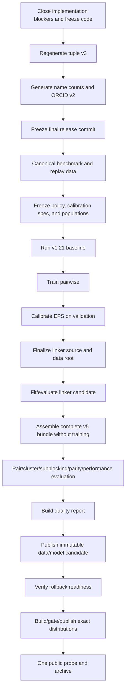

# S2AND v1.3 release runbook

Status: blocked on [1_3_release_blockers.md](1_3_release_blockers.md).

Status date: 2026-07-26

This file is the operator sequence for the canonical-v2 data regeneration,
pairwise/linker retrain, evaluation, and release. It intentionally does not
specify unimplemented command-line interfaces. When a blocker adds or changes a
command, copy the tested command from its `--help` output into the named
insertion point here before closing the blocker.

[normalization_migration_blocked.md](normalization_migration_blocked.md) defines
the normative normalization and quality constraints.
[1_3_release_blockers.md](1_3_release_blockers.md) defines implementation
status. This file owns execution order.

## Fixed release decisions

- Model bundle and public data version: `1.3`.
- Normalization: `canonical_v2`.
- Featurizer contract: `10`.
- Persisted formats remain:
  - `s2and_name_tuples_v3`;
  - `name_counts_index_v2` with `name_counts_provenance_v3`;
  - `orcid_prefix_counts_v2`; and
  - `s2and_production_model_bundle_v5`.
- The model is an immutable external artifact. It is not packaged as the
  default model in the Python distribution.
- The v1.3 release does not introduce compatibility readers, format migrations,
  `evaluation_start.json`, runtime `promotion.json`, or `release_inputs.json`.
- Complete-bundle assembly never trains. It uses the existing v5 finalizer to
  copy the exact evaluated linker artifact and artifact-bound
  `candidate_target.json`.
- The final behavior/package commit is frozen before training. A documentation
  update after public verification is not a new release commit and does not move
  the tag.

The synchronized Python/Rust package version remains a Stage 0 decision because
the selected version must be unused on the target package index.

## Release outcome

A successful release has:

1. one final clean Git commit and locked environment;
2. one immutable canonical-v2 data root and one external complete model bundle;
3. frozen evaluation populations and selection rules;
4. validation-only EPS selection;
5. the exact evaluated linker payload copied into the complete v5 bundle
   without refitting;
6. one passing quality report;
7. real-model Python/Rust parity and clean-installed smoke;
8. one workflow that builds distributions once, pauses for protected approval,
   and publishes those same bytes;
9. Rust publicly installable before Python publication;
10. one successful post-publication probe; and
11. verified rollback readiness before publication.

## Minimal authority set

Each fact has one owner. Reports may refer to another authority by SHA-256 but
must not copy its inventories or approvals.

| Fact | Authority |
|---|---|
| Normative normalization and release thresholds | `normalization_migration_blocked.md` |
| Exact release commit/version matrix, executable metrics, populations, gates, and diagnostic/gating choices | `quality_policy.json` |
| EPS grid, objective, floors, aggregation, and tie-break | `eps_calibration_spec.json` |
| Canonical tuples | tuple data plus adjacent v3 metadata |
| Name counts | `name_counts_index/manifest.json` |
| ORCID counts | ORCID JSON plus adjacent v2 manifest |
| Data release contents | final data-root manifest |
| Pairwise model/training identity | pairwise v5 bundle manifest and training report |
| EPS selection | calibration report and calibrated pairwise manifest |
| Linker payload, target, and prediction identity | `candidate.json` |
| Complete model identity | complete v5 bundle manifest |
| Linker measurements | `linker_evaluation_report.json` |
| Pairwise/cluster/subblocking/parity/performance measurements | corresponding evaluation report |
| Overall quality decision | `quality_report.json` |
| Remote data/model bytes | `remote_candidate_manifest.json` |
| Rollback readiness | `rollback_report.json` |
| Workflow input transport | evidence archive SHA-256 |
| Distribution bytes | workflow `SHA256SUMS` |
| Final release index | small workflow-generated `release.json` |
| Publication approval | protected environment record |
| Public result | one post-publication probe report |

The final `release.json` is an index, not another evidence database. It contains
only:

- release ID and version matrix;
- exact release commit;
- quality-report SHA-256;
- complete-bundle-manifest SHA-256;
- remote-candidate-manifest SHA-256;
- evidence-archive SHA-256; and
- `SHA256SUMS` SHA-256.

The workflow reads the expected release commit and version matrix from the
digest-pinned `quality_policy.json`, verifies that every commit-bearing report
agrees, and copies those values into `release.json`.

## Non-negotiable operating rules

- Use `uv` for every Python environment, command, test, and build.
- Use a local unsynced run root and checkout for heavy work.
- Use fresh output paths. Do not replace a completed generation in place.
- Validate manifests and digests; never infer identity from a directory name.
- Run bounded fixtures before warehouse queries, full conversions, training, or
  uploads.
- Freeze the relevant populations, metrics, thresholds, training command,
  seeds, and selection specifications before revealing a result that could
  influence them.
- Test results may pass or abort the frozen protocol. They may not become a new
  tuning iteration on the same population.
- Full pairwise training may receive sealed test-manifest digests but no test
  paths.
- A candidate-evaluation retry may reload the exact serialized learned payload
  and rescore unchanged inputs. It may not refit or change a binding.
- Preserve failed outputs and logs. Never silently reuse a failed output
  directory.
- Performance and RSS are either hard gates or diagnostics as declared in the
  frozen quality policy. For v1.3 the normative 10% limits are hard gates; there
  is no post-result owner waiver.
- Publication never rebuilds reviewed distributions.

## Dependency sequence



## Run layout

Do not place this root under Google Drive:

```powershell
$RunRoot = "D:\s2and-release-v1.3-YYYYMMDD-attempt-N"
if (Test-Path -LiteralPath $RunRoot) {
  throw "Run root already exists: $RunRoot"
}

$Inputs = "$RunRoot\inputs"
$Stages = "$RunRoot\stages"
$Reports = "$RunRoot\reports"
$Logs = "$RunRoot\logs"
$Jobs = "$RunRoot\jobs"
$WorkflowArtifacts = "$RunRoot\workflow-artifacts"
$Fixtures = "$Inputs\fixtures"
$Targets = "$Inputs\targets"

$PairwiseDataRoot = "$Stages\pairwise-inputs"
$BenchmarkArrowSmokeRoot = "$Stages\benchmark-arrow-smoke"
$ReplayArrowSmokeRoot = "$Stages\linker-replay-arrow-smoke"
$BenchmarkArrowRoot = "$Stages\benchmark-arrow"
$ReplayArrowRoot = "$Stages\linker-replay-arrow"
$LinkerSourceBundle = "$Stages\linker-source-final"
$DataRoot = "$Stages\data-release-v1.3"
$PairwiseSourceModel = "$Stages\pairwise-source\production_model_v1.3"
$PairwiseModel = "$Stages\pairwise-calibrated\production_model_v1.3"
$CompleteModel = "$Stages\complete-model\production_model_v1.3"
$LocalPythonDist = "$Stages\local-dist\python"
$LocalRustDist = "$Stages\local-dist\rust"
$RuntimeDataRoot = "$Stages\runtime-data"
$NameCountsIndex = "$RuntimeDataRoot\name_counts_index"
$ReleasePathConfig = "$Inputs\path_config.json"
$PairwiseInputsManifest = "$PairwiseDataRoot\pairwise_inputs_manifest.json"
$PairwiseTrainingPlan = "$Inputs\pairwise_training_plan.json"

New-Item -ItemType Directory -Path $RunRoot | Out-Null
New-Item -ItemType Directory -Path `
  $Inputs,$Stages,$Reports,$Logs,$Jobs,$WorkflowArtifacts | Out-Null
New-Item -ItemType Directory -Path $Fixtures,$Targets,$RuntimeDataRoot | Out-Null

$PathConfigJson = @{main_data_dir = $RuntimeDataRoot} | ConvertTo-Json -Compress
[System.IO.File]::WriteAllText(
  $ReleasePathConfig,
  "$PathConfigJson`n",
  [System.Text.UTF8Encoding]::new($false)
)
$env:S2AND_PATH_CONFIG = $ReleasePathConfig
```

All commands containing `REVIEWED_*` require literal substitution and review
before execution. Keep `S2AND_PATH_CONFIG` set before importing current
canonical-v2 `s2and`; it selects `$NameCountsIndex` instead of the checked-in
legacy index. Stages 2.4 and 7.2 are the explicit historical-runtime
exceptions.

## Expensive-job evidence

For a warehouse query, full conversion, full model job, sealed evaluation,
performance run, or long upload:

1. exclusively write `$Jobs\<job>-attempt-<n>\launch.json` before launch with
   exact command, working directory, Git/lock/native identity, input digests,
   output/log paths, resource estimate, success criteria, and approval;
2. retain separate stdout/stderr logs;
3. rely on the scheduler's immutable job record when scheduled;
4. for a locally detached process only, write a small `process.json` containing
   launch digest, PID, start time, and log paths; and
5. use the producer's validated report as completion evidence. Write a small
   `completion.json` only when the producer has no report containing exit
   status, elapsed time, and output digests.

There is no mandatory three-file lifecycle. Job logs are evidence, not
model/data schemas.

## Invalidation

- Code, lockfile, native build, normalization, tuple, count, ORCID, or benchmark
  input changes invalidate every downstream artifact that consumed them.
- Pairwise bundle changes invalidate EPS selection, final linker source,
  candidate, complete bundle, and all model gates.
- EPS changes invalidate candidate-member generation, final linker-source
  assembly, candidate, complete bundle, and all model gates.
- Linker payload, target, source, policy, or test-population changes invalidate
  candidate evaluation and everything downstream.
- Quality-policy or evaluation-population changes after any corresponding
  reveal abort the protocol. Further development requires a genuinely untouched
  holdout.
- Package contents or package version changes invalidate distribution build,
  installed smoke, publication, and public verification.
- Any behavior-affecting change after the final release commit requires a new
  final commit and rerunning every affected stage.

## Stage 0: close implementation and freeze the protocol

### 0.1 Close the applicable blockers

Use [1_3_release_blockers.md](1_3_release_blockers.md). Before any full
artifact or model job:

- [ ] The implementation and focused-test portion of every blocker is landed
      before the final release commit. Real artifact/model/upload evidence
      closes at its named stage.
- [ ] B27/B28 and the applicable data-producer checks close before any full
      warehouse query.
- [ ] Each later expensive command waits only for its actual upstream blockers
      and real inputs; publication-only evidence does not block earlier data
      generation.
- [ ] B14 remains closed. B15's verifier and phase-neutral repository-test
      changes land before Stage 1; its actual release-candidate distribution
      evidence closes in Stage 1.4.
- [ ] No v1.3 change introduces tuple v4, name-count v3, ORCID v3, bundle v6,
      `evaluation_start.json`, runtime `promotion.json`, or compatibility
      readers.
- [ ] Every newly implemented CLI below has been copied from tested `--help`
      output; no speculative option remains.

The ledger's `CI` work must be added to and pass normal repository CI before
the code freeze. It does not create operator-stage reports or extra release
gates.

### 0.2 Select versions

Record:

| Component | Final value |
|---|---|
| Model bundle | `1.3` |
| Data release | `1.3` |
| Data generation | `REVIEWED_IMMUTABLE_GENERATION` |
| Python package | `REVIEWED_PYTHON_VERSION` |
| Rust package | `REVIEWED_RUST_VERSION` |
| Normalization | `canonical_v2` |
| Featurizer | `10` |

Python and Rust versions must satisfy the exact dependency in `pyproject.toml`
and must not already exist on the target index.

```powershell
uv run --no-project python scripts/sync_version.py --check
uv lock --check
```

These checks, package-index nonexistence evidence, and the reviewed matrix close
B01.

If a version changes, run `scripts/sync_version.py`, review every resulting
manifest/lock change, and repeat the checks.

### 0.3 Controlled environment

```powershell
uv lock --check
uv sync --all-extras --locked
```

Record the lockfile digest. Freeze thread settings before importing native
libraries:

```powershell
$env:OMP_NUM_THREADS = "REVIEWED_THREAD_COUNT"
$env:RAYON_NUM_THREADS = "REVIEWED_THREAD_COUNT"
$env:MKL_NUM_THREADS = "1"
$env:OPENBLAS_NUM_THREADS = "1"
$env:NUMEXPR_NUM_THREADS = "1"
$env:PYTHONUNBUFFERED = "1"
```

### 0.4 Review quality and selection templates

Create and review under `$Inputs`:

- `quality_policy_template.json`: exact comparison populations, metric formulas,
  denominators, aggregation, gating/diagnostic designation, and thresholds;
- `eps_calibration_spec_template.json`: logical validation population, grid,
  objective, floors, aggregation, and deterministic tie-break;
- `targets/linker_seed_target.json`;
- `fixtures/name_count_rows.json`, a bounded JSON list of objects with string
  `first_name`/`last_name` and a positive integer `count`;
- `fixtures/orcid_rows.json`, a bounded JSON list of reviewed ORCID row objects
  with `orcid`, `first_name`, and nullable `middle`;
- logical pair, cluster, and linker comparison-population definitions; and
- reviewed pairwise/linker training commands, features, search spaces, and
  seeds.

These templates freeze the human choices before data or results are revealed,
but they are not executable release authorities and are not workflow inputs.
Stage 2 creates `quality_policy.json` and `eps_calibration_spec.json` once, after
the final manifests exist. The quality-policy validator must prove that the
executable policy does not weaken the normative constraints in
[normalization_migration_blocked.md](normalization_migration_blocked.md).

### 0.5 Freeze the code candidate used for data generation

- [ ] Every implementation and focused-test change from the blocker ledger is
      committed.
- [ ] The worktree is clean and normal repository CI passes.
- [ ] Record the commit as `REVIEWED_CODE_CANDIDATE`.
- [ ] Repository tests no longer hard-code the tree as `code_only`; synthetic
      tests cover both phase contracts, and the explicit Stage 1.4 verifier owns
      the actual release-candidate check.
- [ ] Stage 1's final release commit may add only the exact reviewed tuple/ORCID
      package bytes and their already-reviewed package declarations/version
      metadata.

If a Stage 1 artifact exposes a producer or validator bug, fix it on a new code
candidate and regenerate every affected artifact. Do not patch behavior in the
artifact-promotion commit.

## Stage 1: regenerate canonical packaged data and freeze the release commit

### 1.1 Regenerate canonical name tuples

The current producer emits the retained v3 contract:

```powershell
$TupleOutput = "$Stages\tuples\s2and_name_tuples_canonical.txt"

uv run --no-sync python scripts/production/generate_canonical_name_tuples.py `
  --source s2and/data/s2and_unnormalized_filtered_name_tuples.txt `
  --output "$TupleOutput"
```

Gate:

- [ ] Output and adjacent metadata were absent before generation.
- [ ] `load_name_tuple_artifact` accepts the staged pair.
- [ ] Metadata schema is exactly `s2and_name_tuples_v3`.
- [ ] Data bytes reproduce the reviewed checked-in canonical artifact.
- [ ] Source/data SHA-256, pair count, normalization, and semantics are correct.
- [ ] Generation accounting was reviewed.

Copy the exact reviewed tuple pair into the clean release checkout only if its
bytes are the intended package bytes. Any unexplained drift stops the release.

### 1.2 Run bounded count fixtures

Use the module-only interfaces:

```powershell
uv run --no-sync python -m scripts.production.counts.generate_name_counts `
  --fixture-input "$Inputs\fixtures\name_count_rows.json" `
  --source-snapshot-id "fixture-v1.3" `
  --limit 1000 `
  --output-dir "$Stages\name-counts-fixture"

uv run --no-sync python -m scripts.production.counts.generate_orcid_name_prefix_counts `
  --input-json "$Inputs\fixtures\orcid_rows.json" `
  --source-snapshot-id "fixture-v1.3" `
  --limit 1000 `
  --name-tuples-path "$TupleOutput" `
  --expected-name-tuples-sha256 "REVIEWED_TUPLE_DATA_SHA256" `
  --output-dir "$Stages\orcid-fixture"
```

Require production-loader validation, reviewed counts/digests, missing-sentinel
rejection, and the retained v2 runtime schemas.

### 1.3 Full warehouse generation

Do not run until B27 and B28 are closed. The exact implemented commands must:

- use the reviewed replacement count-source/query path selected by B28, never
  `pys2`;
- run against independently immutable source evidence;
- accept reviewed guardrail files;
- publish into fresh paths;
- record query text/ID, source evidence, result digest, accounting, artifact
  digest, runtime, and peak RSS; and
- preserve the current runtime artifact formats.

**Command insertion point:** paste the tested name-count and ORCID full commands
here after B27/B28 close. The name-count producer's `--output-dir` must be
`$RuntimeDataRoot`; it creates the previously absent `$NameCountsIndex` beneath
that root. Until then, no full warehouse query is authorized.

After successful generation:

```powershell
uv run --no-sync python scripts/convert_to_arrow.py `
  validate-name-counts-index `
  --output-root "$RuntimeDataRoot"
```

Gate:

- [ ] All four name-count mappings reload and match reviewed cardinalities.
- [ ] Manifest is `name_counts_index_v2` and nested provenance is
      `name_counts_provenance_v3`.
- [ ] ORCID data/manifest reload under `orcid_prefix_counts_v2`.
- [ ] ORCID tuple-data digest equals the reviewed tuple artifact.
- [ ] Warehouse provenance independently binds both generated artifacts.
- [ ] Destination copies match source bytes.
- [ ] The full name-count producer wrote the selected generation at
      `$NameCountsIndex`; no checked-in fallback is accepted.

Promote the reviewed ORCID JSON/manifest and tuple pair into the release
checkout, and declare the intended package-data paths. The external name-count
index is not committed into the wheel.

### 1.4 Freeze the one final release commit

Before training:

```powershell
uv lock --check
uv sync --all-extras --locked
uv run --no-project python scripts/sync_version.py --check
git status --short
git diff --check
```

- [ ] All behavior, workflow, version, tuple, ORCID, and package-data changes
      are reviewed and committed.
- [ ] The external-model decision is reflected in documentation and package
      inventory; no default model files are present.
- [ ] CI passes on this exact commit.
- [ ] Record `git rev-parse HEAD` as `REVIEWED_RELEASE_COMMIT`.
- [ ] Push/merge it to `main`.
- [ ] No later release step changes Python/Rust behavior or package contents.

Create and enter a fresh local checkout at `REVIEWED_RELEASE_COMMIT`. Do not
reuse the earlier checkout's virtual environment:

```powershell
foreach ($DistDir in @($LocalPythonDist, $LocalRustDist)) {
  if (Test-Path -LiteralPath $DistDir) {
    throw "Distribution output already exists: $DistDir"
  }
}

uv lock --check
uv sync --all-extras --locked
uv build --sdist --wheel --out-dir "$LocalPythonDist"
uv run --no-project maturin build `
  --release `
  --locked `
  --compatibility pypi `
  --manifest-path s2and_rust/Cargo.toml `
  --out "$LocalRustDist"
uv run --no-sync python scripts/verification/verify_production_model_distributions.py `
  --dist-dir "$LocalPythonDist" `
  --source-root . `
  --phase release_candidate
```

After B15 closes, `--phase release_candidate` requires no model/default path in
either archive. Tuple and ORCID package bytes must match the reviewed source
bytes. Use this checkout for every remaining local command. Retain the
exact-commit repository CI run, native binary digest, and both local
distribution inventories. These builds are rehearsal inputs only; the
authoritative workflow later builds and publishes its own bytes once from the
same commit.

## Stage 2: build canonical training/evaluation data and baseline

### 2.1 Canonical benchmark export

Run a fixed tiny B06 sample, review it, then run the full producer into the
fresh `$PairwiseDataRoot`.

**Command insertion point:** paste the exact B06 export command after its CLI
and end-to-end fixture close. The full output must include one
`pairwise_inputs_manifest.json` covering:

```text
aminer arnetminer inspire kisti orcid pubmed qian zbmath augmented
```

Validate fixed train/validation/test pairs together before sealing test
manifests. Preserve historical names only in the audit map; training has one
unambiguous canonical-name source.

### 2.2 Benchmark and replay Arrow staging

Use separate smoke and final roots. Copy the complete reviewed name-count index
into each fresh root:

```powershell
foreach ($ArrowRoot in @(
  $BenchmarkArrowSmokeRoot,
  $ReplayArrowSmokeRoot,
  $BenchmarkArrowRoot,
  $ReplayArrowRoot
)) {
  if (Test-Path -LiteralPath $ArrowRoot) {
    throw "Arrow root already exists: $ArrowRoot"
  }
  New-Item -ItemType Directory -Path $ArrowRoot | Out-Null
  Copy-Item -LiteralPath $NameCountsIndex `
    -Destination "$ArrowRoot\name_counts_index" `
    -Recurse
}
```

Run one-dataset smokes only in the smoke roots:

```powershell
uv run --no-sync python scripts/convert_to_arrow.py benchmark `
  --source-root "$PairwiseDataRoot" `
  --output-root "$BenchmarkArrowSmokeRoot" `
  --datasets qian `
  --name-counts-index-root "$BenchmarkArrowSmokeRoot" `
  --n-jobs 4

uv run --no-sync python scripts/convert_to_arrow.py linker-replay `
  --raw-root "REVIEWED_LINKER_RAW_JSON_ROOT" `
  --embeddings-root "REVIEWED_LINKER_SPECTER2_ROOT" `
  --output-root "$ReplayArrowSmokeRoot" `
  --datasets "REVIEWED_REPLAY_SMOKE_DATASET" `
  --name-counts-index-root "$ReplayArrowSmokeRoot" `
  --n-jobs 4
```

The two full commands below are payloads for the detached or scheduled
expensive-job procedure above, with durable logs. Do not run them as foreground
commands.

Run the full benchmark conversion in its still-unused final root:

```powershell
uv run --no-sync python scripts/convert_to_arrow.py benchmark `
  --source-root "$PairwiseDataRoot" `
  --output-root "$BenchmarkArrowRoot" `
  --datasets aminer arnetminer inspire kisti orcid pubmed qian zbmath `
  --name-counts-index-root "$BenchmarkArrowRoot" `
  --n-jobs "REVIEWED_N_JOBS"
```

Run the full replay conversion in its still-unused final root:

```powershell
uv run --no-sync python scripts/convert_to_arrow.py linker-replay `
  --raw-root "REVIEWED_LINKER_RAW_JSON_ROOT" `
  --embeddings-root "REVIEWED_LINKER_SPECTER2_ROOT" `
  --output-root "$ReplayArrowRoot" `
  --run-full `
  --name-counts-index-root "$ReplayArrowRoot" `
  --n-jobs "REVIEWED_N_JOBS"
```

Use explicit datasets instead of `--run-full` if reviewed discovery differs
from the intended release inventory.

This creates B09's release artifact. B09 closes only after the full replay root
and its nested manifests pass the Stage 4 B10 validation.

### 2.3 Assignments and frozen evaluation manifests

- [ ] Generate B07 assignments at base-group granularity.
- [ ] Validate zero base-identity leakage.
- [ ] Assemble and hash pairwise, cluster, and linker independent-gold
      manifests.
- [ ] Run the B11 preflight below. It validates fixed-pair schemas, labels,
      duplicates, and unordered overlaps plus random-block identity isolation,
      then writes a plan containing no test paths.
- [ ] Create `quality_policy.json` exactly once from the reviewed template,
      exact manifest digests, final release commit, and version matrix.
- [ ] Create `eps_calibration_spec.json` exactly once from its reviewed template
      and exact validation-manifest digests.
- [ ] Validate both files and prove the policy does not weaken the normative
      thresholds.
- [ ] Record both digests and freeze both files; no mutation is allowed.

```powershell
uv run --no-sync python scripts/production/model/release_pairwise.py `
  preflight-training-inputs `
  --manifest "$PairwiseInputsManifest" `
  --expected-manifest-sha256 "REVIEWED_PAIRWISE_INPUTS_MANIFEST_SHA256" `
  --output-plan "$PairwiseTrainingPlan"
```

Review and freeze the printed `plan_sha256`. The plan carries absolute
train/validation paths and digests. Its sealed pairwise/cluster sections carry
only manifest and member digests, never test paths.

### 2.4 Historical v1.21 baseline

Run only after B05 closes.

**Command insertion point:** paste the exact tested baseline command here. It
must run v1.21 in its reviewed compatible environment and emit:

- model, booster, code, dependency, and runtime identities;
- observed post-load EPS (expected `0.65` for the historical v1.21 runtime at
  commit `e54c6ba`, whose loader explicitly overrides versions `1.2`/`1.21`);
- selected identities and predictions;
- pairwise, clustering, linker, subblocking, runtime, and RSS metrics required
  by `quality_policy.json`;
- exact population-manifest and policy digests; and
- logical performance workload identity and raw measurements.

The isolated v1.21 environment must not inherit the canonical-v2
`S2AND_PATH_CONFIG`. Unset it or point it at a reviewed frozen legacy data root
containing the exact historical name-count artifact, and record that config and
artifact identity. The historical loader must never fall back to an ambient
download.

Historical Python/Rust parity and unrelated telemetry are not baseline release
gates. If v1.21 training overlap cannot be established, mark the comparison
secondary and use the independently frozen gold population for the headline
gate. The current canonical loader and the stored `clusterer.json` value are not
the v1.21 runtime authority; B05 must execute the compatible historical loader
and record the EPS actually observed after load.

## Stage 3: train the pairwise model

### 3.1 Bounded smoke

Use the B22 content-addressed smoke root, not full fixed-pair CSVs:

```powershell
New-Item -ItemType Directory -Path "$RunRoot\matrix-work-smoke" | Out-Null

uv run --no-sync python scripts/convert_to_arrow.py `
  validate-name-counts-index `
  --output-root "$RuntimeDataRoot"

uv run --no-sync python scripts/production/model/train_pairwise.py `
  --production-version 1.3 `
  --data-dir "REVIEWED_PAIRWISE_SMOKE_ROOT" `
  --output-dir "$Stages\pairwise-smoke\production_model_v1.3" `
  --matrix-work-dir "$RunRoot\matrix-work-smoke" `
  --feature-cache-dir "$RunRoot\feature-cache-smoke" `
  --datasets augmented qian `
  --n-iter 1 `
  --cluster-n-iter 1 `
  --train-pairs-size 1000 `
  --val-test-size 1000 `
  --random-seed 1111 `
  --n-jobs 4
```

The trainer resolves name counts through the already-set
`S2AND_PATH_CONFIG`. Record the resolved path and manifest SHA-256; they must
equal `$NameCountsIndex` and the reviewed v2/v3 manifest.

The B21 writer/reloader/default-branch regression runs in ordinary CI. It does
not create a release report.

### 3.2 Full preflight and launch

Do not run until B23 completes the training report. B11's tested input boundary
is:

- bind tuple, ORCID, name-count, and pairwise-input manifests;
- resolve name counts from the run-specific `S2AND_PATH_CONFIG` and record the
  exact selected index-manifest digest;
- receive sealed pair/cluster test digests but no test paths;
- validate train/validation inputs only;
- use a reviewed local matrix-work parent;
- record the exact search space, seed, resource budget, and final release
  commit; and
- write the pairwise-only v5 bundle to the fresh `$PairwiseSourceModel`.

```powershell
New-Item -ItemType Directory -Path "$RunRoot\matrix-work" | Out-Null

uv run --no-sync python scripts/production/model/train_pairwise.py `
  --production-version 1.3 `
  --training-plan "$PairwiseTrainingPlan" `
  --expected-training-plan-sha256 "REVIEWED_PAIRWISE_TRAINING_PLAN_SHA256" `
  --output-dir "$PairwiseSourceModel" `
  --matrix-work-dir "$RunRoot\matrix-work" `
  --n-iter "REVIEWED_PAIRWISE_N_ITER" `
  --cluster-n-iter "REVIEWED_CLUSTER_N_ITER" `
  --random-seed 1111 `
  --n-jobs "REVIEWED_N_JOBS" `
  --total-ram-bytes "REVIEWED_TOTAL_RAM_BYTES" `
  --preflight-only

uv run --no-sync python scripts/production/model/train_pairwise.py `
  --production-version 1.3 `
  --training-plan "$PairwiseTrainingPlan" `
  --expected-training-plan-sha256 "REVIEWED_PAIRWISE_TRAINING_PLAN_SHA256" `
  --output-dir "$PairwiseSourceModel" `
  --matrix-work-dir "$RunRoot\matrix-work" `
  --n-iter "REVIEWED_PAIRWISE_N_ITER" `
  --cluster-n-iter "REVIEWED_CLUSTER_N_ITER" `
  --random-seed 1111 `
  --n-jobs "REVIEWED_N_JOBS" `
  --total-ram-bytes "REVIEWED_TOTAL_RAM_BYTES" `
  --run-full
```

Completion gate:

- [ ] Process exited zero.
- [ ] Pairwise-only v5 bundle reloads.
- [ ] Main and nameless boosters round-trip through Rust.
- [ ] B23 report contains complete finite validation/trial/selection evidence.
- [ ] Report binds train/validation identities and sealed pair/cluster digests.
- [ ] No candidate test prediction or metric exists.
- [ ] Runtime/RSS and complete output inventory are retained.

## Stage 4: calibrate EPS and finalize the linker source

### 4.1 Validation-only EPS calibration

Use the single B12 release command below with `eps_calibration_spec.json`. Its
source is `$PairwiseSourceModel` and its fresh output is `$PairwiseModel`.

```powershell
uv run python scripts\production\model\release_pairwise.py calibrate-eps `
  --source-bundle "$PairwiseSourceModel" `
  --spec "$Inputs\eps_calibration_spec.json" `
  --expected-spec-sha256 "REVIEWED_EPS_CALIBRATION_SPEC_SHA256" `
  --output-bundle "$PairwiseModel" `
  --output-report "$Reports\eps_calibration_report.json" `
  --n-jobs REVIEWED_N_JOBS `
  --total-ram-bytes REVIEWED_CALIBRATION_RAM_BYTES
```

The command must:

1. validate the source pairwise manifest and calibration spec before matrix
   work;
2. score validation identities only;
3. apply the frozen grid, objective, floors, aggregation, and tie-break;
4. always write one fresh calibrated v5 pairwise bundle;
5. rewrite only `clusterer.json` and `manifest.json`;
6. preserve every other declared member byte; and
7. emit one calibration report binding all trials, selected EPS, and the
   source/output manifests.

There is no conditional second EPS-finalization path.

### 4.2 Generate candidate members after EPS

B25 has one path: always finalize or regenerate candidate members after the
calibrated pairwise manifest is frozen. Do not carry an EPS-independence branch.

### 4.3 Assemble final linker source and data root once

Run the B19 final assembly only after benchmark Arrow, replay Arrow, assignments,
candidate members, name counts, and required helpers are complete.

```powershell
uv run python scripts\production\model\linker_source_bundle.py `
  assemble-source-bundle `
  --member-spec "$Inputs\linker_source_member_spec.json" `
  --source-root "REVIEWED_LINKER_SOURCE_ROOT" `
  --benchmark-arrow-root "$BenchmarkArrowRoot" `
  --replay-arrow-root "$ReplayArrowRoot" `
  --output-source-bundle "$LinkerSourceBundle" `
  --output-data-root "$DataRoot"
```

It creates:

- `$LinkerSourceBundle` with one complete source manifest; and
- `$DataRoot` with one final data-root manifest covering benchmark data, nested
  replay data, name counts, and required root helpers.

Then run the exact B10 validator.

```powershell
uv run python scripts\production\model\linker_source_bundle.py `
  validate-source-bundle `
  --source-bundle-root "$LinkerSourceBundle" `
  --data-root "$DataRoot"
```

Gate:

- [ ] Every consumed non-Arrow source member is inventoried.
- [ ] Every nested Arrow/data manifest and name-count binding matches.
- [ ] Assignments have zero leakage.
- [ ] No required table/support file is absent or empty.
- [ ] Data-root and source-manifest SHA-256 values are retained.

Equal-size/equal-mtime mutation coverage remains an ordinary B19 CI regression,
not an operator action on the release artifact.

## Stage 5: fit and evaluate the linker candidate

### 5.1 Preflight and bounded materialization

The seed target remains under `$Inputs\targets`, outside every fresh output.
After B13/B19 expose digest arguments, run the exact preflight first.

**Command insertion point:** after B13/B19 close, paste the tested digest-bound
preflight and bounded-materialization commands here.

### 5.2 Candidate run

Run only after B13 provides the payload-first candidate interface.

**Command insertion point:** paste the tested B13 candidate command here.

The implementation must:

1. fit on train/calibration only;
2. serialize and hash the learned payload before opening the frozen test
   population;
3. validate policy, baseline, source, pairwise, seed-target, and actual
   population bindings;
4. evaluate that exact payload;
5. write the artifact-bound `candidate_target.json`;
6. save the exact evaluated artifact;
7. write deterministic predictions, `candidate.json`, and
   `linker_evaluation_report.json`; and
8. return nonzero on validation or infrastructure failure without discarding
   available audit outputs.

`candidate.json` owns only payload/target/prediction identity and binds those
files by digest. `linker_evaluation_report.json` owns the measured linker
result. The current artifact schema also requires `candidate_target.json` to
carry the observed metrics for exact replay; those values are derived, must
equal the linker report exactly, and are not a second measurement or decision
authority. Neither file approves the release: a metric shortfall does not
prevent structurally valid bundle assembly, and `quality_report.json` is the
sole aggregate pass/fail authority. There is no evaluation-start record or
arbitrary one-retry state machine. An infrastructure retry reloads the same
payload and unchanged bindings; it never refits.

### 5.3 No-training complete-bundle assembly

Run after B20 adds a thin command around
`s2and.production_bundle.finalize_production_bundle` and the candidate files
are structurally complete. Assembly does not approve the candidate.

**Command insertion point:** paste the tested B20 assembly command here.

Gate:

- [ ] Assembly invokes no fit, tuning, or feature materialization.
- [ ] Pairwise manifest-declared members are copied byte-for-byte.
- [ ] Candidate linker artifact files are copied byte-for-byte.
- [ ] Bundled reproduction target equals `candidate_target.json`.
- [ ] Linker `target_spec_digest` matches that target.
- [ ] Complete manifest is `s2and_production_model_bundle_v5`.
- [ ] Complete bundle reloads and embedded fixtures pass.

No `promotion.json` is placed in the bundle. Stage 6's quality report compares
candidate and complete-bundle bytes directly.

## Stage 6: evaluate the complete candidate

### 6.1 Pairwise and clustering

Only sealed evaluators may open candidate test members. B30 must validate the
quality policy, model, and population before scoring, then atomically write the
report. Preserve the existing validation-before-score ordering, but do not
create a separate unblind/start receipt.

```powershell
uv run python scripts\production\model\release_pairwise.py evaluate-pairs `
  --model "$CompleteModel" `
  --expected-model-manifest-sha256 "REVIEWED_COMPLETE_MODEL_MANIFEST_SHA256" `
  --quality-policy "$Inputs\quality_policy.json" `
  --expected-quality-policy-sha256 "REVIEWED_QUALITY_POLICY_SHA256" `
  --manifest "$Inputs\pairwise_test_manifest.json" `
  --expected-manifest-sha256 "REVIEWED_PAIRWISE_TEST_MANIFEST_SHA256" `
  --output-report "$Reports\pairwise_evaluation_report.json" `
  --n-jobs REVIEWED_N_JOBS `
  --total-ram-bytes REVIEWED_PAIR_EVALUATION_RAM_BYTES

uv run python scripts\production\model\release_pairwise.py evaluate-clusters `
  --model "$CompleteModel" `
  --expected-model-manifest-sha256 "REVIEWED_COMPLETE_MODEL_MANIFEST_SHA256" `
  --quality-policy "$Inputs\quality_policy.json" `
  --expected-quality-policy-sha256 "REVIEWED_QUALITY_POLICY_SHA256" `
  --manifest "$Inputs\cluster_test_manifest.json" `
  --expected-manifest-sha256 "REVIEWED_CLUSTER_TEST_MANIFEST_SHA256" `
  --output-report "$Reports\cluster_evaluation_report.json" `
  --n-jobs REVIEWED_N_JOBS
```

Require:

- finite main and nameless probabilities in `[0,1]`;
- exactly one average of positive probabilities;
- strict `> 0.5` for pairwise macro F1;
- exact population/model/policy bindings; and
- no training or parameter selection.

### 6.2 Linker and subblocking

- [ ] Consume the Stage 5 `linker_evaluation_report.json`; do not rescore or
      create a second linker result.
- [ ] Exact candidate-target replay and finite independent-gold linker
      measurements are present and bind the candidate, population, and policy.
- [ ] Base-group leakage remains zero.
- [ ] No subblocking member is lost or duplicated.
- [ ] Maximum size and seed-component integrity pass.
- [ ] Required ORCID, dash/alias, missing-name, and giant-block cases pass.
- [ ] One structured subblocking report binds its exact input manifest and
      generated outputs.

Ordinary pytest/JUnit output is CI evidence, not a release authority and not an
input to `quality_report.json`.

```powershell
uv run python `
  scripts\verification\compare_graph_subblocking_arrow_quality.py `
  --arrow-root "REVIEWED_SUBBLOCKING_ARROW_DATASET_ROOT" `
  --expected-input-manifest-sha256 `
    "REVIEWED_SUBBLOCKING_INPUT_MANIFEST_SHA256" `
  --output-dir "$Stages\subblocking-report" `
  --comparison-mode rust-only `
  --component-members-parquet "REVIEWED_COMPONENT_MEMBERS_PARQUET" `
  --maximum-size REVIEWED_MAXIMUM_SUBBLOCK_SIZE `
  --allow-full
```

### 6.3 Python/Rust parity

Use the complete model and manifest-backed fixture. Require exact discrete
features, bounded floating-point differences, matching main/nameless
probabilities, matching constraints, and matching final incremental decisions.
The parity report binds the complete-model and fixture-manifest digests.

```powershell
uv run python scripts\verification\compare_full_predict_arrow_parity.py `
  --fixture-dir "$Fixtures\full-predict-arrow-parity" `
  --expected-fixture-manifest-sha256 `
    "REVIEWED_PARITY_FIXTURE_MANIFEST_SHA256" `
  --output-dir "$Stages\full-predict-parity" `
  --output-json "$Reports\full_predict_arrow_parity.json" `
  --name-counts-index "$NameCountsIndex" `
  --model-path "$CompleteModel" `
  --expected-model-manifest-sha256 `
    "REVIEWED_COMPLETE_MODEL_MANIFEST_SHA256" `
  --block-size REVIEWED_PARITY_BLOCK_SIZE `
  --n-jobs REVIEWED_N_JOBS `
  --total-ram-bytes REVIEWED_PARITY_RAM_BYTES `
  --compare-features `
  --use-cluster-seeds
```

### 6.4 Runtime and peak RSS

Use the same logical workload, hardware class, threads, warmups, repetitions,
and reducer as the baseline. The performance report records raw runs and a
deterministic workload ID.

For v1.3, runtime and peak RSS must satisfy the frozen normative 10% gates.
There is no measured-result waiver. A workload mismatch is a protocol failure,
not an exception.

```powershell
uv run python `
  scripts\_rust_suite\promoted_incremental_arrow_profile_cmd.py `
  --arrow-root "REVIEWED_PROFILE_ARROW_ROOT" `
  --dataset "REVIEWED_PROFILE_DATASET" `
  --expected-data-manifest-sha256 "REVIEWED_PROFILE_DATA_MANIFEST_SHA256" `
  --model-path "$CompleteModel" `
  --expected-model-manifest-sha256 `
    "REVIEWED_COMPLETE_MODEL_MANIFEST_SHA256" `
  --expected-workload-sha256 "REVIEWED_PROFILE_WORKLOAD_SHA256" `
  --target-block "REVIEWED_PROFILE_TARGET_BLOCK" `
  --query-limit REVIEWED_PROFILE_QUERY_LIMIT `
  --max-seed-clusters REVIEWED_PROFILE_MAX_SEED_CLUSTERS `
  --runs REVIEWED_PROFILE_RUNS `
  --n-jobs REVIEWED_N_JOBS `
  --batching-threshold REVIEWED_PROFILE_BATCHING_THRESHOLD `
  --total-ram-bytes REVIEWED_PROFILE_RAM_BYTES `
  --output-dir "$Stages\performance-profile" `
  --write-json "$Reports\performance_evaluation_report.json" `
  --require-rust-release `
  --full-run
```

### 6.5 Quality report

B32 adds one deterministic quality-report producer. It consumes:

- quality policy and baseline;
- pairwise source/training and calibrated manifests;
- EPS calibration spec/report;
- candidate manifest and complete bundle;
- pairwise, cluster, linker, subblocking, parity, and performance reports.

It:

- validates every digest and candidate-to-complete-bundle byte binding;
- validates that derived `candidate_target.json` metrics exactly equal the
  linker evaluation report;
- checks executable policy against the normative contract;
- applies every frozen hard gate once;
- rejects missing/non-finite results;
- records diagnostics without converting them into gates; and
- writes one passing or failing `quality_report.json`.

No approval or post-hoc exception is embedded. `quality_report.json` is the only
aggregate pass/fail decision. A failing hard gate aborts before Stage 7.

**Command insertion point:** paste the tested B32 quality-report command here.

## Stage 7: candidate upload, rollback readiness, and package release

### 7.1 Upload the immutable data/model candidate

Run only with a passing `quality_report.json`. The remote candidate contains:

- final data-root tree and manifest;
- tuple data/metadata;
- ORCID data/manifest; and
- complete external v5 model bundle.

Warehouse and tuple-generation reports are release evidence, not data-candidate
members.

**Command insertion point:** paste the tested B17 dry-run and real upload
commands here.

Run B17's dry-run and a bounded disposable-prefix rehearsal, then upload to a
fresh immutable candidate prefix. This makes the bytes available to the release
workflow but does not update documentation or a mutable public pointer. The
publisher:

1. builds the complete local inventory;
2. refuses every existing destination;
3. uploads members;
4. verifies remote size and a provider cryptographic checksum when available,
   otherwise re-downloads and hashes the member;
5. fully downloads/verifies manifests and the model/data needed by the real
   installed smoke; and
6. generates and uploads canonical `remote_candidate_manifest.json` last, only
   after every other member is verified.

`remote_candidate_manifest.json` is the only authority containing the physical
candidate prefix. If any upload fails after writing a member, mark that prefix
abandoned and restart at a new prefix. Never retry, overwrite, or rewrite
upstream local manifests; create the remote manifest only for the successful
prefix.

### 7.2 Verify rollback readiness before publication

Identify the exact previous complete release:

- Python package;
- matching Rust package;
- model bundle;
- tuple, name-count, ORCID, and Arrow data;
- documented immutable data/model URL.

In a clean staging environment:

1. install the previous Python and matching Rust packages with the previous
   model/data set and run its real smoke;
2. verify the exact restore commands, immutable URLs, versions, and digests;
3. bind the successful v1.3 `remote_candidate_manifest.json`; and
4. if publication changes a real mutable deployment selector, rehearse only
   that selector's candidate-to-previous switch and rerun the previous smoke.
   Otherwise record the selector rehearsal as `not_applicable` with the reason.

The previous release uses its own reviewed path config and complete legacy data
root; clear the v1.3 `S2AND_PATH_CONFIG` before importing the previous package.
Never point previous code at `$ReleasePathConfig`.

Write one `rollback_report.json` containing the previous complete-set identity,
restore commands, smoke result, candidate-manifest digest, and optional selector
rehearsal result. Local exact-commit Python/Rust wheels may be used for a
selector rehearsal, but their digests are rehearsal evidence and never
authorize the workflow-built distributions.

**Command insertion point:** paste the tested B33 rollback-report validation
command here.

Rollback never mixes components and never deletes or overwrites an immutable
v1.3 candidate. PyPI recovery means pinning/redeploying the previous matching
versions or publishing a corrective version; published files are not replaced.

Publication is blocked until this report passes.

### 7.3 Build the one evidence archive

The archive uses fixed logical paths and contains:

- frozen quality policy, EPS calibration spec, and pair/cluster/linker
  comparison manifests;
- `targets/linker_seed_target.json`;
- baseline report;
- tuple-generation and warehouse-provenance reports;
- pairwise manifest/training report;
- EPS calibration report and calibrated manifest;
- final linker-source and data-root manifests;
- `candidate.json`, `candidate_target.json`, and
  `linker_evaluation_report.json`;
- complete-bundle manifest;
- pairwise, cluster, subblocking, parity, performance, and quality reports;
- remote candidate manifest; and
- `rollback_report.json`.

It excludes raw predictions, raw logs, scratch data, job lifecycle records,
duplicated inventories, upload receipts, and platform approval records.

One supported packager:

- validates every required logical member and digest;
- rejects missing, duplicate, unexpected, or path-traversing entries;
- writes one ZIP; and
- prints/records its SHA-256.

Byte-identical ZIP output across independent roots is not a release requirement;
the reviewed archive's SHA-256 is its transport identity.

**Command insertion point:** paste the tested B34 evidence-packaging and
immutable-upload commands here.

Upload the exact archive to one absent immutable URL. After partial failure, use
a new URL. The workflow receives only:

- evidence archive URL; and
- evidence archive SHA-256.

There is no `release_inputs.json` or separate control-upload protocol.

### 7.4 Authoritative workflow

After B26's implementation tests pass and B32-B34 produce their reviewed
inputs, dispatch the exact tested workflow at `REVIEWED_RELEASE_COMMIT` with the
evidence URL and SHA-256. Do not use a local latest-run heuristic; identify the
run by exact head SHA and dispatch time.

**Command insertion point:** paste the tested workflow-dispatch command here.

Before protected approval, the workflow:

1. verifies and safely extracts the evidence archive;
2. requires the exact logical allowlist;
3. reads the expected commit/version matrix from `quality_policy.json`, verifies
   `GITHUB_SHA` and every commit-bearing report against it;
4. validates passing quality and rollback reports,
   candidate-to-complete-bundle continuity, and remote data/model identity;
5. builds every Python/Rust distribution exactly once;
6. runs distribution validation;
7. installs exact built wheels in clean environments;
8. downloads the remote data/model candidate and runs the real v1.3 smoke;
9. generates `SHA256SUMS`;
10. generates the small `release.json`;
11. uploads distributions, checksums, index, and smoke reports for review; and
12. pauses at one protected `release-gate`.

The successful step 8 smoke is B16's real release-candidate closure evidence.
The workflow runs this tested command form after installing and downloading the
exact reviewed artifacts:

```powershell
uv run --no-project python `
  scripts\verification\smoke_installed_incremental_arrow.py release-candidate `
  --model-dir "$CompleteModel" `
  --data-root "$DataRoot" `
  --dataset "REVIEWED_SMOKE_DATASET" `
  --signature-ids `
    "REVIEWED_SEED_SIGNATURE_1" `
    "REVIEWED_SEED_SIGNATURE_2" `
    "REVIEWED_QUERY_SIGNATURE" `
  --expected-model-manifest-sha256 `
    "REVIEWED_COMPLETE_MODEL_MANIFEST_SHA256" `
  --expected-data-manifest-sha256 "REVIEWED_DATA_MANIFEST_SHA256" `
  --expected-name-counts-manifest-sha256 `
    "REVIEWED_NAME_COUNTS_MANIFEST_SHA256"
```

After approval:

1. confirm the already uploaded immutable data/model candidate still matches
   the reviewed remote manifest;
2. publish Rust;
3. retry an exact-version public-index Rust install with bounded logging;
4. publish Python only after that probe passes;
5. publish the already built bytes without rebuilding; and
6. run one post-publication probe.

Both publish jobs recheck their artifacts against the same `SHA256SUMS`.

## Stage 8: one post-publication verification and archive

The workflow's one bounded probe:

1. resolves exact public Python/Rust versions with bounded retries;
2. installs them into a new empty environment;
3. downloads the public immutable data/model artifacts;
4. verifies remote manifest and declared digests;
5. runs the real pairwise and incremental Rust-backed smoke; and
6. proves public package hashes equal workflow `SHA256SUMS`.

That probe report is the public release result. Do not repeat the same
install/download/hash/smoke in another checklist.

After it passes:

- [ ] archive the evidence archive, workflow artifacts, protected approval
      record, public probe report, release index, manifests, raw predictions,
      job records, completion evidence, and relevant logs;
- [ ] tag `REVIEWED_RELEASE_COMMIT` and create release notes that link the
      verified immutable data/model URL;
- [ ] update documentation to the verified immutable URL;
- [ ] confirm the tag still names `REVIEWED_RELEASE_COMMIT`;
- [ ] leave all approved records immutable; and
- [ ] retain the previous complete release and rollback evidence.

If public verification fails, stop documentation promotion and execute the
verified rollback/recovery procedure. Do not overwrite or delete immutable
published artifacts.
