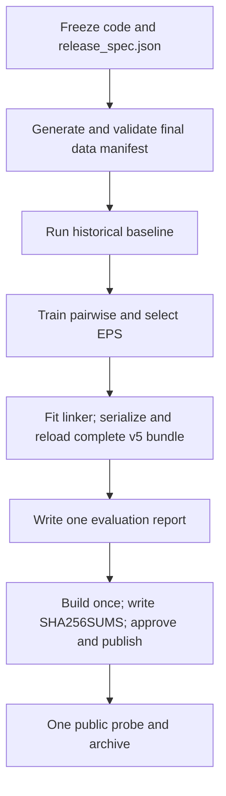

# S2AND v1.3 release runbook

Status: blocked on [1_3_release_blockers.md](1_3_release_blockers.md).

Status date: 2026-07-26

This file is the operator sequence for the canonical-v2 data regeneration,
pairwise/linker retrain, evaluation, and release. It intentionally does not
specify unimplemented command-line interfaces. When a blocker adds or changes a
command, copy the tested command from its `--help` output into the named
insertion point here before closing the blocker.

[normalization_migration_blocked.md](normalization_migration_blocked.md) defines
the normative normalization and quality constraints.
[1_3_release_blockers.md](1_3_release_blockers.md) defines implementation
status. This file owns execution order.

## Fixed release decisions

- Model bundle and public data version: `1.3`.
- Normalization: `canonical_v2`.
- Featurizer contract: `10`.
- Persisted formats remain:
  - `s2and_name_tuples_v3`;
  - `name_counts_index_v2` with `name_counts_provenance_v3`;
  - `orcid_prefix_counts_v2`; and
  - `s2and_production_model_bundle_v5`.
- The model is an immutable external artifact. It is not packaged as the
  default model in the Python distribution.
- The v1.3 release does not introduce compatibility readers, format migrations,
  `evaluation_start.json`, runtime `promotion.json`, or `release_inputs.json`.
- The final calibrated pairwise bundle always triggers one fresh linker feature
  materialization and fit. That command serializes a complete v5 bundle, reloads
  the exact serialized bundle, and only then evaluates it. Never carry a linker
  across a pairwise-manifest change and never fit again for publication.
- The final behavior/package commit is frozen before training. A documentation
  update after public verification is not a new release commit and does not move
  the tag.

The synchronized Python/Rust package version remains a Stage 0 decision because
the selected version must be unused on the target package index.

## Release outcome

A successful release has:

1. one final clean Git commit and locked environment;
2. one immutable canonical-v2 data root and one external complete model bundle;
3. frozen evaluation populations and selection rules;
4. validation-only EPS selection;
5. one linker fitted against the final calibrated pairwise bundle, serialized
   into the complete v5 bundle, reloaded, and evaluated once;
6. one passing evaluation report;
7. real-model Python/Rust parity and clean-installed smoke;
8. one workflow that builds distributions once, pauses for protected approval,
   and publishes those same bytes;
9. Rust publicly installable before Python publication;
10. one successful post-publication probe; and
11. a verified rollback procedure before publication.

## Five release authorities

The release has exactly five semantic authorities:

| Authority | Owns |
|---|---|
| `$Inputs\release_spec.json` | Exact commit and version matrix; normalization and feature contracts; training seeds and commands; EPS selection rule; evaluation populations, metrics, thresholds, diagnostics, performance workload, and publication coordinates. |
| `$DataRoot\manifest.json` | Every released data member and nested data-manifest identity, including tuple, count, benchmark, replay, assignment, and evaluation-population bytes. |
| `$CompleteModel\manifest.json` | Every runtime and reproducibility member of the complete v5 model, including pairwise boosters, the freshly trained linker, and `reproducibility/incremental_linker_training_target.json`. |
| `$Reports\evaluation_report.json` | Baseline and v1.3 measurements, parity, subblocking, runtime/RSS, all gate results, and the exact release-spec/data/model manifest SHA-256 values evaluated. |
| `$WorkflowArtifacts\SHA256SUMS` | Exact distribution and published data/model bytes built and released by the workflow. |

Component manifests and producer logs may exist beneath these authorities.
They are implementation detail or operational evidence, not additional release
decisions. The evaluator evidence manifest and its immutable URL/SHA-256 are
input transport for the evaluator and workflow, not a sixth authority.

## Non-negotiable operating rules

- Use `uv` for every Python environment, command, test, and build.
- Use a local unsynced run root and checkout for heavy work.
- Use fresh output paths. Do not replace a completed generation in place.
- Validate manifests and digests; never infer identity from a directory name.
- Run bounded fixtures before warehouse queries, full conversions, training, or
  uploads.
- Freeze the relevant populations, metrics, thresholds, training command,
  seeds, and selection specifications before revealing a result that could
  influence them.
- Test results may pass or abort the frozen protocol. They may not become a new
  tuning iteration on the same population.
- Full pairwise training may receive sealed test-manifest digests but no test
  paths.
- The one-shot linker command serializes the fresh fit into the complete
  bundle, reloads that exact bundle, and only then materializes held-out test
  features and evaluates it. Failed runs retain their outputs and logs; each
  reviewed rerun uses fresh output paths.
- Preserve failed outputs and logs. Never silently reuse a failed output
  directory.
- Runtime is a hard gate at no more than 10% regression under the pinned
  protocol. Peak RSS is reported as a diagnostic and must remain below the
  predeclared absolute ceiling. There is no relative RSS gate or post-result
  waiver.
- Publication never rebuilds reviewed distributions.

## Dependency sequence



## Run layout

Do not place this root under Google Drive:

```powershell
$RunRoot = "D:\s2and-release-v1.3-YYYYMMDD-attempt-N"
if (Test-Path -LiteralPath $RunRoot) {
  throw "Run root already exists: $RunRoot"
}

$Inputs = "$RunRoot\inputs"
$Stages = "$RunRoot\stages"
$Reports = "$RunRoot\reports"
$Logs = "$RunRoot\logs"
$Jobs = "$RunRoot\jobs"
$WorkflowArtifacts = "$RunRoot\workflow-artifacts"
$Fixtures = "$Inputs\fixtures"
$Targets = "$Inputs\targets"

$PairwiseDataRoot = "$Stages\pairwise-inputs"
$BenchmarkArrowSmokeRoot = "$Stages\benchmark-arrow-smoke"
$ReplayArrowSmokeRoot = "$Stages\linker-replay-arrow-smoke"
$BenchmarkArrowRoot = "$Stages\benchmark-arrow"
$ReplayArrowRoot = "$Stages\linker-replay-arrow"
$LinkerSourceBundle = "$Stages\linker-source-final"
$DataRoot = "$Stages\data-release-v1.3"
$PairwiseSourceModel = "$Stages\pairwise-source\production_model_v1.3"
$PairwiseModel = "$Stages\pairwise-calibrated\production_model_v1.3"
$LinkerFinalOutput = "$Stages\linker-final"
$CompleteModel = "$LinkerFinalOutput\production_model_v1.3"
$LocalPythonDist = "$Stages\local-dist\python"
$LocalRustDist = "$Stages\local-dist\rust"
$RuntimeDataRoot = "$Stages\runtime-data"
$NameCountsIndex = "$RuntimeDataRoot\name_counts_index"
$ReleasePathConfig = "$Inputs\path_config.json"
$ReleaseSpec = "$Inputs\release_spec.json"
$PairwiseInputsManifest = "$PairwiseDataRoot\pairwise_inputs_manifest.json"
$PairwiseTrainingPlan = "$Inputs\pairwise_training_plan.json"

New-Item -ItemType Directory -Path $RunRoot | Out-Null
New-Item -ItemType Directory -Path `
  $Inputs,$Stages,$Reports,$Logs,$Jobs,$WorkflowArtifacts | Out-Null
New-Item -ItemType Directory -Path $Fixtures,$Targets,$RuntimeDataRoot | Out-Null

$PathConfigJson = @{main_data_dir = $RuntimeDataRoot} | ConvertTo-Json -Compress
[System.IO.File]::WriteAllText(
  $ReleasePathConfig,
  "$PathConfigJson`n",
  [System.Text.UTF8Encoding]::new($false)
)
$env:S2AND_PATH_CONFIG = $ReleasePathConfig
```

All commands containing `REVIEWED_*` require literal substitution and review
before execution. Keep `S2AND_PATH_CONFIG` set before importing current
canonical-v2 `s2and`; it selects `$NameCountsIndex` instead of the checked-in
legacy index. Stages 2.4 and 7.2 are the explicit historical-runtime
exceptions.

## Expensive-job evidence

For a warehouse query, full conversion, full model job, sealed evaluation,
performance run, or long upload, the scheduler record or validated producer
report is authoritative. Retain stdout/stderr logs and the exact submitted
command with that authority; do not transcribe a second lifecycle.

Only a locally detached process needs a repository-side job record. Its
supported launcher automatically writes one
`$Jobs\<job>-attempt-<n>\job.json` containing the command, working directory,
Git/lock/native identity, input digests, output/log paths, resource estimate,
success criteria, approval reference, PID, and start time. The producer report
supplies completion status and output digests. Do not hand-author
`launch.json`, `process.json`, or `completion.json`.

Until that launcher exists and its command is tested, use the scheduler path
instead of improvising a detached-job record.

Job records and logs are operational evidence, not model/data schemas.

## Invalidation

- Code, lockfile, native build, normalization, tuple, count, ORCID, or benchmark
  input changes invalidate every downstream artifact that consumed them.
- Pairwise bundle changes invalidate EPS selection and pairwise-derived linker
  features. Regenerate the final linker source and rerun Stage 5 to fit,
  serialize, and reload a fresh complete bundle, then rerun evaluation.
- EPS changes invalidate linker-source member generation and the complete model.
  Regenerate those inputs and rerun Stage 5.
- Never reuse a linker across either change.
- Linker payload, training target, source, release spec, or test-population
  changes invalidate the evaluation report and everything downstream.
- Release-spec or evaluation-population changes after any corresponding
  reveal abort the protocol. Further development requires a genuinely untouched
  holdout.
- Package contents or package version changes invalidate distribution build,
  installed smoke, publication, and public verification.
- Any behavior-affecting change after the final release commit requires a new
  final commit and rerunning every affected stage.

## Stage 0: close implementation and freeze the protocol

### 0.1 Close the applicable blockers

Use [1_3_release_blockers.md](1_3_release_blockers.md). Before any full
artifact or model job:

- [ ] The implementation and focused-test portion of every blocker is landed
      before the final release commit. Real artifact/model/upload evidence
      closes at its named stage.
- [ ] B27/B28 and the applicable data-producer checks close before any full
      warehouse query.
- [ ] Each later expensive command waits only for its actual upstream blockers
      and real inputs; publication-only evidence does not block earlier data
      generation.
- [ ] B14 remains closed. B15's fixed verifier and focused tests land before
      Stage 1; evidence from the actual release distributions closes in
      Stage 1.4.
- [ ] No v1.3 change introduces tuple v4, name-count v3, ORCID v3, bundle v6,
      `evaluation_start.json`, runtime `promotion.json`, or compatibility
      readers.
- [ ] Every newly implemented CLI below has been copied from tested `--help`
      output; no speculative option remains.

### 0.2 Select versions

Record:

| Component | Final value |
|---|---|
| Model bundle | `1.3` |
| Data release | `1.3` |
| Data generation | `REVIEWED_IMMUTABLE_GENERATION` |
| Python package | `REVIEWED_PYTHON_VERSION` |
| Rust package | `REVIEWED_RUST_VERSION` |
| Normalization | `canonical_v2` |
| Featurizer | `10` |

Python and Rust versions must satisfy the exact dependency in `pyproject.toml`
and must not already exist on the target index.

```powershell
uv run --no-project python scripts/sync_version.py --check
uv lock --check
```

These checks, package-index nonexistence evidence, and the reviewed matrix close
B01.

If a version changes, run `scripts/sync_version.py`, review every resulting
manifest/lock change, and repeat the checks.

### 0.3 Controlled environment

```powershell
uv lock --check
uv sync --all-extras --locked
```

Record the lockfile digest. Freeze thread settings before importing native
libraries:

```powershell
$env:OMP_NUM_THREADS = "REVIEWED_THREAD_COUNT"
$env:RAYON_NUM_THREADS = "REVIEWED_THREAD_COUNT"
$env:MKL_NUM_THREADS = "1"
$env:OPENBLAS_NUM_THREADS = "1"
$env:NUMEXPR_NUM_THREADS = "1"
$env:PYTHONUNBUFFERED = "1"
```

### 0.4 Review the release specification

Create and review `$ReleaseSpec` before any result is revealed. It contains:

- the exact commit and version matrix;
- comparison populations, metric formulas, denominators, aggregation,
  gating/diagnostic designation, and thresholds;
- the EPS validation population, grid, objective, floors, aggregation, and
  deterministic tie-break;
- reviewed pairwise/linker training commands, features, search spaces, seeds,
  performance workload, and RSS ceiling; and
- the logical path of `targets/incremental_linker_training_target.json`.

Also create the bounded development fixtures under `$Inputs`:

- `fixtures/name_count_rows.json`, a bounded JSON list of objects with string
  `first_name`/`last_name` and a positive integer `count`;
- `fixtures/orcid_rows.json`, a bounded JSON list of reviewed ORCID row objects
  with `orcid`, `first_name`, and nullable `middle`.

The release spec is the single executable owner of these choices and a workflow
input. Validate it against the normative constraints in
[normalization_migration_blocked.md](normalization_migration_blocked.md), then
freeze its SHA-256. Later stages fill no result-derived choices into it.

### 0.5 Freeze the code revision used for data generation

- [ ] Every implementation and focused-test change from the blocker ledger is
      committed.
- [ ] The worktree is clean and normal repository CI passes.
- [ ] Record the commit as `REVIEWED_CODE_REVISION`.
- [ ] Synthetic distribution tests cover the one fixed release contract, and
      the explicit Stage 1.4 verifier checks the actual archives.
- [ ] Stage 1's final release commit may add only the exact reviewed tuple/ORCID
      package bytes and their already-reviewed package declarations/version
      metadata.

If a Stage 1 artifact exposes a producer or validator bug, fix it in a new
revision and regenerate every affected artifact. Do not patch behavior in the
final release commit.

## Stage 1: regenerate canonical packaged data and freeze the release commit

### 1.1 Regenerate canonical name tuples

The current producer emits the retained v3 contract:

```powershell
$TupleOutput = "$Stages\tuples\s2and_name_tuples_canonical.txt"

uv run --no-sync python scripts/production/generate_canonical_name_tuples.py `
  --source s2and/data/s2and_unnormalized_filtered_name_tuples.txt `
  --output "$TupleOutput"
```

Gate:

- [ ] Output and adjacent metadata were absent before generation.
- [ ] `load_name_tuple_artifact` accepts the staged pair.
- [ ] Metadata schema is exactly `s2and_name_tuples_v3`.
- [ ] Data bytes reproduce the reviewed checked-in canonical artifact.
- [ ] Source/data SHA-256, pair count, normalization, and semantics are correct.
- [ ] Generation accounting was reviewed.
- [ ] The checked-in adjudication ledger still maps exactly 1,343 accepts into
      the artifact and excludes all 906 rejects and 17 uncertain pairs.

Copy the exact reviewed tuple pair into the clean release checkout only if its
bytes are the intended package bytes. Any unexplained drift stops the release.

### 1.2 Run bounded count fixtures

Use the module-only interfaces:

```powershell
uv run --no-sync python -m scripts.production.counts.generate_name_counts `
  --fixture-input "$Inputs\fixtures\name_count_rows.json" `
  --source-snapshot-id "fixture-v1.3" `
  --limit 1000 `
  --output-dir "$Stages\name-counts-fixture"

uv run --no-sync python -m scripts.production.counts.generate_orcid_name_prefix_counts `
  --input-json "$Inputs\fixtures\orcid_rows.json" `
  --source-snapshot-id "fixture-v1.3" `
  --limit 1000 `
  --name-tuples-path "$TupleOutput" `
  --expected-name-tuples-sha256 "REVIEWED_TUPLE_DATA_SHA256" `
  --output-dir "$Stages\orcid-fixture"
```

Require production-loader validation, reviewed counts/digests, missing-sentinel
rejection, and the retained v2 runtime schemas.

### 1.3 Full warehouse generation

Do not run until B27 and B28 are closed. The exact implemented commands must:

- use the reviewed replacement count-source/query path selected by B28, never
  `pys2`;
- run against independently immutable source evidence;
- accept reviewed guardrail files;
- publish into fresh paths;
- record query text/ID, source evidence, result digest, accounting, artifact
  digest, runtime, and peak RSS; and
- preserve the current runtime artifact formats.

**Command insertion point:** paste the tested name-count and ORCID full commands
here after B27/B28 close. The name-count producer's `--output-dir` must be
`$RuntimeDataRoot`; it creates the previously absent `$NameCountsIndex` beneath
that root. Until then, no full warehouse query is authorized.

After successful generation:

```powershell
uv run --no-sync python scripts/convert_to_arrow.py `
  validate-name-counts-index `
  --output-root "$RuntimeDataRoot"
```

Gate:

- [ ] All four name-count mappings reload and match reviewed cardinalities.
- [ ] Manifest is `name_counts_index_v2` and nested provenance is
      `name_counts_provenance_v3`.
- [ ] ORCID data/manifest reload under `orcid_prefix_counts_v2`.
- [ ] ORCID tuple-data digest equals the reviewed tuple artifact.
- [ ] Warehouse provenance independently binds both generated artifacts.
- [ ] Destination copies match source bytes.
- [ ] The full name-count producer wrote the selected generation at
      `$NameCountsIndex`; no checked-in fallback is accepted.

Promote the reviewed ORCID JSON/manifest and tuple pair into the release
checkout, and declare the intended package-data paths. The external name-count
index is not committed into the wheel.

### 1.4 Freeze the one final release commit

Before training:

```powershell
uv lock --check
uv sync --all-extras --locked
uv run --no-project python scripts/sync_version.py --check
git status --short
git diff --check
```

- [ ] All behavior, workflow, version, tuple, ORCID, and package-data changes
      are reviewed and committed.
- [ ] The external-model decision is reflected in documentation and package
      inventory; no default model files are present.
- [ ] CI passes on this exact commit.
- [ ] Record `git rev-parse HEAD` as `REVIEWED_RELEASE_COMMIT`.
- [ ] Push/merge it to `main`.
- [ ] No later release step changes Python/Rust behavior or package contents.

Create and enter a fresh local checkout at `REVIEWED_RELEASE_COMMIT`. Do not
reuse the earlier checkout's virtual environment:

```powershell
foreach ($DistDir in @($LocalPythonDist, $LocalRustDist)) {
  if (Test-Path -LiteralPath $DistDir) {
    throw "Distribution output already exists: $DistDir"
  }
}

uv lock --check
uv sync --all-extras --locked
uv build --sdist --wheel --out-dir "$LocalPythonDist"
uv run --no-project maturin build `
  --release `
  --locked `
  --compatibility pypi `
  --manifest-path s2and_rust/Cargo.toml `
  --out "$LocalRustDist"
uv run --no-sync python scripts/verification/verify_production_model_distributions.py `
  --dist-dir "$LocalPythonDist" `
  --source-root .
```

The fixed verifier requires canonical tuple/ORCID bytes in both archives,
rejects packaged default/model paths, and compares every declared package-data
member to the source tree. Use this checkout for every remaining local command.
Retain the exact-commit repository CI run, native binary digest, and both local
distribution inventories. These builds are rehearsal inputs only; the
authoritative workflow later builds and publishes its own bytes once from the
same commit.

## Stage 2: build canonical training/evaluation data and baseline

### 2.1 Canonical benchmark export

Run a fixed tiny B06 sample, review it, then run the full producer into the
fresh `$PairwiseDataRoot`.

**Command insertion point:** paste the exact B06 export command after its CLI
and end-to-end fixture close. The full output must include one
`pairwise_inputs_manifest.json` covering:

```text
aminer arnetminer inspire kisti orcid pubmed qian zbmath augmented
```

Validate fixed train/validation/test pairs together before sealing test
manifests. Preserve historical names only in the audit map; training has one
unambiguous canonical-name source.

### 2.2 Benchmark and replay Arrow staging

Use separate smoke and final roots. Copy the complete reviewed name-count index
into each fresh root:

```powershell
foreach ($ArrowRoot in @(
  $BenchmarkArrowSmokeRoot,
  $ReplayArrowSmokeRoot,
  $BenchmarkArrowRoot,
  $ReplayArrowRoot
)) {
  if (Test-Path -LiteralPath $ArrowRoot) {
    throw "Arrow root already exists: $ArrowRoot"
  }
  New-Item -ItemType Directory -Path $ArrowRoot | Out-Null
  Copy-Item -LiteralPath $NameCountsIndex `
    -Destination "$ArrowRoot\name_counts_index" `
    -Recurse
}
```

Run one-dataset smokes only in the smoke roots:

```powershell
uv run --no-sync python scripts/convert_to_arrow.py benchmark `
  --source-root "$PairwiseDataRoot" `
  --output-root "$BenchmarkArrowSmokeRoot" `
  --datasets qian `
  --name-counts-index-root "$BenchmarkArrowSmokeRoot" `
  --n-jobs 4

uv run --no-sync python scripts/convert_to_arrow.py linker-replay `
  --raw-root "REVIEWED_LINKER_RAW_JSON_ROOT" `
  --embeddings-root "REVIEWED_LINKER_SPECTER2_ROOT" `
  --output-root "$ReplayArrowSmokeRoot" `
  --datasets "REVIEWED_REPLAY_SMOKE_DATASET" `
  --name-counts-index-root "$ReplayArrowSmokeRoot" `
  --n-jobs 4
```

The two full commands below are payloads for the detached or scheduled
expensive-job procedure above, with durable logs. Do not run them as foreground
commands.

Run the full benchmark conversion in its still-unused final root:

```powershell
uv run --no-sync python scripts/convert_to_arrow.py benchmark `
  --source-root "$PairwiseDataRoot" `
  --output-root "$BenchmarkArrowRoot" `
  --datasets aminer arnetminer inspire kisti orcid pubmed qian zbmath `
  --name-counts-index-root "$BenchmarkArrowRoot" `
  --n-jobs "REVIEWED_N_JOBS"
```

Run the full replay conversion in its still-unused final root:

```powershell
uv run --no-sync python scripts/convert_to_arrow.py linker-replay `
  --raw-root "REVIEWED_LINKER_RAW_JSON_ROOT" `
  --embeddings-root "REVIEWED_LINKER_SPECTER2_ROOT" `
  --output-root "$ReplayArrowRoot" `
  --run-full `
  --name-counts-index-root "$ReplayArrowRoot" `
  --n-jobs "REVIEWED_N_JOBS"
```

Use explicit datasets instead of `--run-full` if reviewed discovery differs
from the intended release inventory.

This creates B09's release artifact. B09 closes only after the full replay root
and its nested manifests pass the Stage 4 B10 validation.

### 2.3 Assignments and frozen evaluation populations

- [ ] Generate B07 assignments at base-group granularity.
- [ ] Validate zero base-identity leakage.
- [ ] Assemble pairwise, cluster, and linker independent-gold members beneath
      the data root.
- [ ] Run the B11 preflight below. It validates fixed-pair schemas, labels,
      duplicates, and unordered overlaps plus random-block identity isolation,
      then writes a plan containing no test paths.
- [ ] Validate that the realized populations exactly match `$ReleaseSpec`.
- [ ] Do not expose sealed test paths to either trainer.

```powershell
uv run --no-sync python scripts/production/model/release_pairwise.py `
  preflight-training-inputs `
  --manifest "$PairwiseInputsManifest" `
  --expected-manifest-sha256 "REVIEWED_PAIRWISE_INPUTS_MANIFEST_SHA256" `
  --output-plan "$PairwiseTrainingPlan"
```

Review and freeze the printed `plan_sha256`. The plan carries absolute
train/validation paths and digests. Its sealed pairwise/cluster sections carry
only member digests from the eventual data manifest, never test paths.

### 2.4 Historical v1.21 baseline

Run only after B05 closes.

**Command insertion point:** paste the exact tested baseline command here. It
must run v1.21 in its reviewed compatible environment and emit:

- model, booster, code, dependency, and runtime identities;
- observed post-load EPS (expected `0.65` for the historical v1.21 runtime at
  commit `e54c6ba`, whose loader explicitly overrides versions `1.2`/`1.21`);
- selected identities and predictions;
- pairwise, clustering, linker, subblocking, runtime, and RSS metrics required
  by `$ReleaseSpec`;
- exact release-spec and data-manifest digests; and
- logical performance workload identity and raw measurements.

The isolated v1.21 environment must not inherit the canonical-v2
`S2AND_PATH_CONFIG`. Unset it or point it at a reviewed frozen legacy data root
containing the exact historical name-count artifact, and record that config and
artifact identity. The historical loader must never fall back to an ambient
download.

Historical Python/Rust parity and unrelated telemetry are not baseline release
gates. If v1.21 training overlap cannot be established, mark the comparison
secondary and use the independently frozen gold population for the headline
gate. The evaluator incorporates the retained baseline measurements into the
single evaluation report. The current canonical loader and the stored
`clusterer.json` value are not the v1.21 runtime authority; B05 must execute the
compatible historical loader and record the EPS actually observed after load.

## Stage 3: train the pairwise model

### 3.1 Launch the release-only trainer

Focused fixture tests cover the bounded trainer behavior before this expensive
run. The CLI has no smoke, dataset-selector, feature-cache, or preflight-only
mode. Do not launch until B23 completes the training-report contract.

B11's tested input boundary must:

- verify the training-plan path and expected SHA-256;
- load tuple and ORCID artifacts from the packaged authority and use the
  external `$NameCountsIndex`;
- receive sealed pair/cluster test digests but no test paths;
- validate train/validation inputs only;
- use a reviewed local matrix-work parent;
- record the exact search space, seed, resource budget, and final release
  commit; and
- write the pairwise-only v5 bundle to the fresh `$PairwiseSourceModel`.

```powershell
New-Item -ItemType Directory -Path "$RunRoot\matrix-work" | Out-Null

uv run --no-sync python scripts/production/model/train_pairwise.py `
  --production-version 1.3 `
  --training-plan "$PairwiseTrainingPlan" `
  --expected-training-plan-sha256 "REVIEWED_PAIRWISE_TRAINING_PLAN_SHA256" `
  --name-counts-index-root "$NameCountsIndex" `
  --output-dir "$PairwiseSourceModel" `
  --matrix-work-dir "$RunRoot\matrix-work" `
  --validation-pairs-size "REVIEWED_VALIDATION_PAIRS_SIZE" `
  --n-iter "REVIEWED_PAIRWISE_N_ITER" `
  --cluster-n-iter "REVIEWED_CLUSTER_N_ITER" `
  --random-seed 1111 `
  --n-jobs "REVIEWED_N_JOBS" `
  --total-ram-bytes "REVIEWED_TOTAL_RAM_BYTES" `
  --run-full
```

Completion gate:

- [ ] Process exited zero.
- [ ] Pairwise-only v5 bundle reloads.
- [ ] Main and nameless boosters round-trip through Rust.
- [ ] B23 report contains complete finite validation/trial/selection evidence.
- [ ] Report binds train/validation identities and sealed pair/cluster digests.
- [ ] No test prediction or metric exists.
- [ ] Runtime/RSS and complete output inventory are retained.

## Stage 4: calibrate EPS and finalize the linker source

### 4.1 Validation-only EPS calibration

Use the single B12 validation-only command with the EPS rule in `$ReleaseSpec`.
Its source is `$PairwiseSourceModel` and its fresh output is `$PairwiseModel`.

**Command insertion point:** paste the tested release-spec-driven calibration
command here when its CLI is final.

The command must:

1. validate the release spec, data manifest, and source pairwise manifest before
   matrix work;
2. score validation identities only;
3. apply the frozen grid, objective, floors, aggregation, and tie-break;
4. always write one fresh calibrated v5 pairwise bundle;
5. rewrite only `clusterer.json` and `manifest.json`; and
6. preserve every other declared member byte.

Retain the calibration report as an operational record. The selected EPS is
encoded in the finalized pairwise bundle; neither the report nor its validation
measurements become another evidence-manifest member. There is no conditional
second EPS-finalization path.

### 4.2 Generate linker source members after EPS

B25 has one path: always finalize or regenerate linker source members after the
calibrated pairwise manifest is frozen. Do not carry an EPS-independence branch.

### 4.3 Assemble the final linker source and data root once

Run the B19 final assembly only after benchmark Arrow, replay Arrow, assignments,
linker source members, name counts, and required helpers are complete.

```powershell
uv run python scripts\production\model\linker_source_bundle.py `
  assemble-source-bundle `
  --member-spec "$Inputs\linker_source_member_spec.json" `
  --source-root "REVIEWED_LINKER_SOURCE_ROOT" `
  --benchmark-arrow-root "$BenchmarkArrowRoot" `
  --replay-arrow-root "$ReplayArrowRoot" `
  --output-source-bundle "$LinkerSourceBundle" `
  --output-data-root "$DataRoot"
```

It creates the internal `$LinkerSourceBundle` inventory and the authoritative
`$DataRoot\manifest.json`, which covers benchmark data, nested replay data,
assignments, name counts, and required root helpers.

Then run the exact B10 validator:

```powershell
uv run python scripts\production\model\linker_source_bundle.py `
  validate-source-bundle `
  --source-bundle-root "$LinkerSourceBundle" `
  --data-root "$DataRoot"
```

Gate:

- [ ] Every consumed source member is covered by the data-root manifest,
      directly or through a declared nested manifest.
- [ ] Every nested Arrow/data manifest and name-count binding matches.
- [ ] Assignments have zero leakage.
- [ ] No required table/support file is absent or empty.
- [ ] The final data-manifest SHA-256 is retained.

Equal-size/equal-mtime mutation coverage remains an ordinary B19 CI regression,
not an operator action on the release artifact.

## Stage 5: retrain the linker and finalize the complete model

This is the release's only linker fit. The selected `$PairwiseModel` supplies
pairwise-model-derived linker features, so a linker from an earlier pairwise
manifest is invalid.

### 5.1 Direct finalization

The target remains under `$Inputs\targets`, outside every fresh output. Focused
fixture tests cover materialization before this approved expensive launch. The
release entrypoint has no lifecycle subcommands or durable feature staging:

```powershell
uv run python scripts\production\model\train_linker_and_finalize.py `
  --source-bundle-root "$LinkerSourceBundle" `
  --target-json "$Targets\incremental_linker_training_target.json" `
  --pairwise-model-path "$PairwiseModel" `
  --name-counts-index-root "$NameCountsIndex" `
  --output-dir "$LinkerFinalOutput" `
  --n-jobs REVIEWED_N_JOBS `
  --total-ram-bytes REVIEWED_LINKER_RAM_BYTES
```

On success, `$LinkerFinalOutput` contains only `$CompleteModel` and
`linker_evaluation_report.json`. The command must:

1. rematerialize pairwise-derived features from the final `$PairwiseModel` and
   fit a fresh linker on train/calibration only;
2. serialize the linker with a binding to the exact pairwise feature contract
   and both booster digests;
3. write `$CompleteModel`, including the frozen
   `reproducibility/incremental_linker_training_target.json`;
4. reload the exact complete v5 bundle before opening the frozen test rows;
5. evaluate through the reloaded artifact and retain deterministic predictions
   as operational output; and
6. return nonzero on validation or infrastructure failure without fitting a
   second model.

Gate:

- [ ] Exactly one linker fit occurred.
- [ ] Complete manifest is `s2and_production_model_bundle_v5`.
- [ ] Linker metadata binds `$PairwiseModel` and the embedded training target.
- [ ] Complete bundle reloads and embedded fixtures pass.
- [ ] All held-out linker measurements came from the reloaded complete bundle.

Stage 5 diagnostics are inputs to Stage 6. They are not additional release
authorities, and no `promotion.json` is placed in the bundle.

## Stage 6: write one evaluation report

Stage 6 consumes `$ReleaseSpec`, `$DataRoot\manifest.json`,
`$CompleteModel\manifest.json`, and the retained historical baseline.
Component evaluators validate their bindings before reading sealed members;
`evaluate-release` applies the frozen gates to their digest-indexed outputs and
atomically writes `$Reports\evaluation_report.json`.

The pinned `s2and_release_evidence_manifest_v1` has exactly nine members:
the release spec, data manifest, complete-model manifest, and the six
pairwise, clustering, linker, subblocking, parity, and performance reports.
After those members are complete, run:

```powershell
$EvaluationEvidenceManifest = "$Stages\evaluation-components\evidence_manifest.json"
$EvaluationEvidenceManifestSha256 = ((Get-FileHash -LiteralPath $EvaluationEvidenceManifest -Algorithm SHA256).Hash).ToLowerInvariant()

uv run --frozen python scripts\production\model\release_pairwise.py evaluate-release `
  --evidence-manifest "$EvaluationEvidenceManifest" `
  --expected-evidence-manifest-sha256 `
    "$EvaluationEvidenceManifestSha256" `
  --output-report "$Reports\evaluation_report.json"
```

The six component reports and the evidence manifest are evaluator inputs, not
semantic authorities. The `s2and_release_evaluation_report_v1` output binds the
release-spec, data-manifest, and complete-model-manifest SHA-256 values.

The report must contain:

- the SHA-256 of the release spec, data manifest, and complete-model manifest;
- baseline and v1.3 pairwise AUROC/macro F1, clustering F1, and per-dataset
  results on identical populations;
- finite linker independent-gold diagnostics from the reloaded complete
  bundle; these are recorded but are not a release gate until B32 freezes a
  threshold;
- the applied subblocking, complete-model parity, runtime, and peak-RSS gate
  results; and
- one top-level boolean `passed`.

The evaluator performs no training, tuning, or parameter selection. It uses
strict `> 0.5` for pairwise macro F1, averages main/nameless positive
probabilities exactly once, rejects non-finite probabilities, enforces the
release-spec runtime/RSS policy, and exits nonzero when `passed` is false.

Component tools may write scratch predictions or measurements under `$Stages`.
Those files are retained for debugging but are not release authorities.

## Stage 7: verify, build, approve, and publish

### 7.1 Stage the evaluator inputs

Run only when `$Reports\evaluation_report.json` has `passed: true`. Upload the
unchanged nine evidence-manifest members to fresh immutable locations. Refuse
existing destinations and verify every remote byte by provider checksum or
re-download. The local report proves readiness; the workflow reruns the same
deterministic gate after staging the manifest.

**Command insertion point:** paste the tested B17 dry-run and immutable-upload
commands here.

If an upload fails after writing a member, abandon that prefix and use a new
one. Do not overwrite an authority or rewrite its manifest.

### 7.2 Rehearse rollback

In a clean environment, install the exact previous Python/Rust packages with
their matching model and data, run the previous real smoke, and verify the
restore commands and immutable URLs. Clear the v1.3 `S2AND_PATH_CONFIG` before
importing the previous package.

Rollback is an executed workflow check recorded in ordinary logs, not a sixth
authority. Publication stops if it fails. Recovery never mixes release
components or overwrites immutable bytes; it pins/redeploys the previous
complete set or publishes a corrective version.

### 7.3 Pin the evaluator evidence manifest

Upload each member to the immutable HTTPS URL already recorded in the evaluated
manifest, then upload the unchanged manifest and record its URL and SHA-256. Do
not copy policy, approval, or rollback results into it. The URL and digest are
workflow inputs, not a semantic release authority.

**Command insertion point:** paste the tested immutable-upload command here
after B26 implements it.

### 7.4 Authoritative workflow

Dispatch the exact tested workflow at the commit named in `$ReleaseSpec`, using
only the evidence-manifest URL and SHA-256. Identify the run by exact head SHA
and dispatch time.

**Command insertion point:** paste the tested workflow-dispatch command here.

B26 is still open. The target authoritative workflow must, before protected
approval:

1. verifies the evidence manifest and each indexed input;
2. reruns `evaluate-release`, retains its report, and stops when a gate fails;
3. verifies the release-spec commit/version matrix against `GITHUB_SHA`;
4. verifies the data and complete-model manifests;
5. safely extracts any archive, rejecting links, traversal, duplicate
   destinations, and unexpected members;
6. builds each Python/Rust distribution exactly once;
7. validates and clean-installs the exact built distributions;
8. downloads the immutable data/model and runs the real v1.3 smoke;
9. writes `$WorkflowArtifacts\SHA256SUMS` over all distribution and published
   data/model bytes;
10. verifies the completed rollback rehearsal; and
11. pauses at one protected `release-gate`.

The checked-in workflow currently stages and evaluates the evidence,
clean-installs the frozen distributions, and runs the script's no-argument
synthetic smoke. It does not yet implement items 8-11 as written, so B16 and
B26 remain open. B16 closes only when the workflow runs this tested
real-artifact command after installing and downloading the exact reviewed
artifacts:

```powershell
uv run --no-project python `
  scripts\verification\smoke_installed_incremental_arrow.py release-candidate `
  --model-dir "$CompleteModel" `
  --data-root "$DataRoot" `
  --dataset "REVIEWED_SMOKE_DATASET" `
  --signature-ids `
    "REVIEWED_SEED_SIGNATURE_1" `
    "REVIEWED_SEED_SIGNATURE_2" `
    "REVIEWED_QUERY_SIGNATURE" `
  --expected-model-manifest-sha256 `
    "REVIEWED_COMPLETE_MODEL_MANIFEST_SHA256" `
  --expected-data-manifest-sha256 "REVIEWED_DATA_MANIFEST_SHA256" `
  --expected-name-counts-manifest-sha256 `
    "REVIEWED_NAME_COUNTS_MANIFEST_SHA256"
```

After approval:

1. confirm the staged data/model still match their manifests and
   `SHA256SUMS`;
2. publish Rust;
3. retry an exact-version public-index Rust install with bounded logging;
4. publish Python only after that probe passes;
5. publish the already built bytes without rebuilding; and
6. run one post-publication probe.

Both publish jobs recheck their artifacts against the same `SHA256SUMS`.

## Stage 8: one post-publication verification and archive

The workflow's one bounded probe:

1. resolves exact public Python/Rust versions with bounded retries;
2. installs them into a new empty environment;
3. downloads the public immutable data/model artifacts;
4. verifies the data/model manifests and `SHA256SUMS`;
5. runs the real pairwise and incremental Rust-backed smoke; and
6. proves public package hashes equal workflow `SHA256SUMS`.

That probe report is the public release result. Do not repeat the same
install/download/hash/smoke in another checklist.

After it passes:

- [ ] archive the release spec, data manifest, complete-model manifest,
      evaluation report, `SHA256SUMS`, workflow artifacts, protected approval
      record, public probe output, and relevant operational logs;
- [ ] tag `REVIEWED_RELEASE_COMMIT` and create release notes that link the
      verified immutable data/model URL;
- [ ] update documentation to the verified immutable URL;
- [ ] confirm the tag still names `REVIEWED_RELEASE_COMMIT`;
- [ ] leave all approved records immutable; and
- [ ] retain the previous complete release and rollback instructions.

If public verification fails, stop documentation promotion and execute the
verified rollback/recovery procedure. Do not overwrite or delete immutable
published artifacts.
